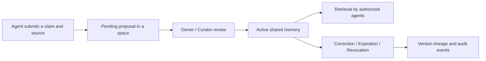

<p align="right"><a href="./README.md">简体中文</a> · <strong>English</strong></p>

# Memoria Agent

**A local memory system that humans can review, trace, and share with multiple agents under explicit permissions.** It lets you decide which claims become shared memory, who may read them, and when they should be corrected or revoked. The personal agent workspace remains available for creating and inspecting memories.

> Agent proposal → human review → space-scoped sharing → version conflict check → revocation and audit

Memoria runs locally and stores data in SQLite. Chat and automatic extraction use the OpenAI-compatible endpoint you configure; shared-memory governance can run without a model.

## Core workflow



The shared layer checks space permissions before search and lookup by a known ID. Changes to an existing topic must confirm its current version to prevent concurrent reviews from overwriting it. Personal chat memories use a separate review queue; administrators can explicitly import active personal memories as shared proposals.

## What you can do

- **Govern shared memory:** Give agents separate keys and private or shared spaces. Reader, contributor, and curator roles control access. Every shared claim requires review before recall.
- **Control versions and lifecycle:** Replacing a conflicting claim requires an explicit current-version ID. Expiration, revocation, and grant changes affect retrieval immediately, while sources and audit events remain available to reviewers.
- **Review long-term memory:** Extracted facts and preferences enter a review queue first. Open the original message, edit a candidate, then approve or reject it. Pending candidates never enter recall.
- **Inspect and correct:** Open a focused editor directly from any active memory. Follow its source ID to the original conversation, inspect its history, and save a correction with a reason. Only the active version is recalled.
- **Use chat and tools:** Persist sessions, stream replies, recall memory, and run tools through Tool Search or MCP. The Dashboard shows jobs and traces; optional Drift runs selected skills while idle.

## Quick start

You need **Python 3.11+**, **Node.js/npm**, and Git. Chat and automatic extraction also require an OpenAI-compatible model endpoint. These commands target Linux/macOS; on Windows, use WSL.

```bash
git clone https://github.com/ZJ331456/Memoria-Agent.git
cd Memoria-Agent

python3 -m venv .venv
.venv/bin/python -m pip install -r requirements.txt
npm ci --prefix frontend
npm run build --prefix frontend
.venv/bin/python main.py
```

Open <http://127.0.0.1:2237>. On first launch, the Setup page asks for the main model's **Model, Base URL, and API Key**, and lets you test the connection. Fast and embedding models can be configured later. Without an embedding model, lexical memory retrieval still works.

To try shared-memory governance first, open **共享治理** (Shared governance). This flow does not require a model. The page keeps an agent key in memory only; paste it again after a refresh.

Model settings are saved in the Git-ignored `data/models.override.toml`; the API never echoes keys. You can also copy `config.example.toml` to `config.toml` and use environment variables for model and runtime settings.

## First use

### Shared memory collaboration

1. Create an agent under Shared governance and save its key, which is shown only once. Connect as that agent and create a space; its creator becomes the owner.
2. Create another agent and grant its ID the reader, contributor, or curator role. Readers retrieve, contributors submit, curators review, and owners manage membership.
3. Submit content, a stable `topic_key`, and a source. An owner or curator approves or rejects it with a reason; changes to an existing topic must confirm the version being replaced.
4. Retrieve approved content using another identity and inspect its lineage; owners and curators can inspect audit events after revocation. A private space is available only to its owner.

### Personal memory workspace

1. Tell Memoria a real preference or goal on the Chat page and finish a conversation.
2. Open Memory → **待审核候选** (Pending review). Use **查看原始对话** (View original conversation) to check context, then edit and approve the candidate or reject it.
3. Open Memory → **有效记忆库** (Active memory library) and choose **检查并纠正** (Inspect and correct). The editor opens immediately with the content field focused. Enter a reason before saving; the old version stays in the timeline.

Memory → **存储与任务** (Storage and jobs) shows Markdown views and extraction jobs. `MEMORY.md` is generated from active memories, while `SELF.md` is editable and enters conversation context. Unsaved Markdown edits remain as a draft in the current browser tab until saved. The older `PENDING.md` remains readable; SQLite is the source of truth for the review queue.

Existing chat memories and new shared spaces are stored separately. A local memory becomes shared only after an administrator explicitly imports it as a proposal and a reviewer approves it. Multi-agent isolation currently applies to the shared-memory API; the existing chat runtime remains a local single-user workflow.

## Optional capabilities

To change runtime options, first run `cp config.example.toml config.toml`; restart the server after editing it.

| Capability | How to enable it |
| --- | --- |
| Semantic retrieval | Configure an embedding model in Setup; run `.venv/bin/python -m pip install -r requirements-vector.txt` if you want the SQLite vector index |
| MCP tools | Run `cp mcp_servers.example.json data/mcp_servers.json`, configure the servers you need, and reload them in the Dashboard |
| Idle Drift | Set `enabled = true` under `[agent.drift]` in `config.toml`; it is off by default, with options for idle time, quiet hours, daily budget, and tool allowlists |
| API access controls | Configure `api_token`, allowed origins, and rate limits under `[server.security]` in `config.toml` |

Runtime data lives in `data/` by default, and the server listens on `127.0.0.1:2237`. Restart the server after upgrading dependencies.

## Repository guide

Each directory README describes its files, call paths, configuration, and checks:

| Directory | Contents |
| --- | --- |
| [memoria](memoria/README.md) | Python services, shared governance, and the personal agent runtime; module guides cover lifecycle, prompting, memory, tools, MCP, and more |
| [frontend](frontend/README.md) | React workspace, pages and APIs, UI components, drafts, and identity cache behavior |
| [eval](eval/README.md) | Retrieval and governance evaluation, independent scoring, capacity and latency benchmarks |
| [skills](skills/README.md) | Usage and triggers for five built-in skills, plus the SKILL.md format |
| [tests](tests/README.md) | Regression tests grouped by capability, optional dependencies, and coverage boundaries |

Module guides are currently written in Chinese; this project overview is available in both languages.

## Development and checks

```bash
.venv/bin/python -m pip install pytest
.venv/bin/python -m pytest -q
.venv/bin/python -m eval.run_governance
npm run build --prefix frontend
(cd frontend && npx playwright install chromium)
npm run test:e2e --prefix frontend
```

Run these commands from the repository root. For frontend development, run `npm run dev --prefix frontend` in another terminal. Vite proxies `/api` to `http://127.0.0.1:2237`. Directory READMEs provide focused checks for individual modules.

## Evaluation

The repository includes 24 governance regression cases that need no model, plus a separate local capacity and latency script:

```bash
.venv/bin/python -m eval.run_governance --min-pass-rate 1 --max-leak-rate 0
.venv/bin/python -m eval.benchmark_shared_memory --memories 1000 --spaces 10 --queries 200
```

The governance evaluation reports authorized recall, isolation leakage, lifecycle correctness, conflict review, and source matching separately. The [archived sample](eval/results/README.md) from 2026-10-02 passed 24/24 cases with zero leakage. These small synthetic cases do not establish generalization, and storage latency excludes HTTP and model calls.

For public data, start with [GateMem](https://github.com/rzhub/GateMem) for authorization and forgetting in shared memory. Use a fixed small subset of [LongMemEval](https://github.com/xiaowu0162/LongMemEval) for knowledge updates and abstention, or [LoCoMo](https://github.com/snap-research/locomo) evidence IDs for source recall across sessions. This repository has not published official scores on these public benchmarks.

## Related Projects

These open-source projects informed parts of Memoria-Agent's design. Memoria-Agent is an independent implementation.

- [Pask](https://github.com/xzf-thu/Pask) — Proactive agents and hierarchical long-term memory.
- [akashic-agent](https://github.com/kachofugetsu09/akashic-agent) — Agent runtime, memory layers, and background jobs.
- [claude-mem](https://github.com/thedotmack/claude-mem) — Session capture, compression, and context recall across sessions.
- [Holt](https://github.com/holt-os/holt) — Personal agent memory with visible sources.
- [Mem0](https://github.com/mem0ai/mem0) — Memory storage and retrieval for agents.
- [Graphiti](https://github.com/getzep/graphiti) — Temporal knowledge graph framework with validity windows and hybrid retrieval.
- [A-mem](https://github.com/WujiangXu/AgenticMemory) — Agentic memory with self-organizing notes, links, and continuous evolution.
