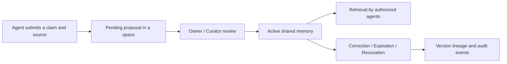

<p align="right"><a href="./README.md">简体中文</a> · <strong>English</strong></p>

# Memoria Agent

**A local memory system that humans can review, trace, and share with multiple agents under explicit permissions.** It lets you decide which claims become shared memory, who may read them, and when they should be corrected or revoked. The personal agent workspace remains available for creating and inspecting memories.

> Agent proposal → human review → space-scoped sharing → version conflict check → revocation and audit

Memoria runs locally and stores data in SQLite. Chat and automatic extraction use the OpenAI-compatible endpoint you configure; shared-memory governance can run without a model.

## Core workflow



The shared layer checks space permissions before search and lookup by a known ID. Changes to an existing topic must confirm its current version to prevent concurrent reviews from overwriting it. Personal chat memories use a separate review queue; administrators can explicitly import active personal memories as shared proposals.

## What you can do

- **Govern shared memory:** Give agents separate keys and private or shared spaces. Reader, contributor, and curator roles control access. Every shared claim requires review before recall.
- **Control versions and lifecycle:** Replacing a conflicting claim requires an explicit current-version ID. Expiration, revocation, and grant changes affect retrieval immediately, while sources and audit events remain available to reviewers.
- **Review long-term memory:** Extracted facts and preferences enter a review queue first. Open the original message, edit a candidate, then approve or reject it. Pending candidates never enter recall.
- **Inspect and correct:** Open a focused editor directly from any active memory. Follow its source ID to the original conversation, inspect its history, and save a correction with a reason. Only the active version is recalled.
- **Use layered memory:** Allocate context by memory type, retrieve task episodes with source links, review facts, identify skill revisions, and archive expired episodes while protecting pinned ones.
- **Use chat and tools:** Persist sessions, stream replies, recall memory, and run tools through Tool Search or MCP. The Dashboard shows jobs and traces; optional Drift runs selected skills while idle.

## Memory architecture

| Responsibility | Implementation |
| --- | --- |
| Working memory | Recent messages and incremental summaries; protect the latest request and bound each context section |
| Episodic memory | Task execution records across sessions, results, source messages, and trace IDs; relevance-based recall |
| Semantic memory | Confirmed facts, preferences, and goals with provenance, corrections, and versions |
| Procedural memory | Load `SKILL.md` on demand and record its content fingerprint |
| Forgetting and governance | TTL, soft archives, pins, version replacement, shared permissions, and revocation |

Forgetting applies across layers. A completed turn does not automatically become a fact or a verified skill. Episodes start with a 90-day TTL and top-3 recall; the memory frame is capped at 12,000 characters. Adjust these local starting values under `[memory.layers]`. The [memory module README](memoria/memory/README.md) links the Chinese layer guide and primary-source research. Character limits are not exact token budgets.

Personal memory creation, replacement, correction, and source undo maintain validity intervals in one transaction. Restoring an older memory preserves the intervening version in historical queries. Time-constrained queries use hybrid retrieval, and graph scores accumulate edge weights before reranking. Embeddings are isolated by model namespace and dimension without clearing previous vectors. Shared proposals validate local references at submission and approval; reviewers still need to verify that the source supports the claim.

## Quick start

You need **Python 3.11+**, **Node.js/npm**, and Git. Chat and automatic extraction need an OpenAI-compatible model endpoint (remote API or a local HTTP server). Shared-memory governance can run without a model.

### 1. Install dependencies and build the frontend

**Linux / macOS:**

```bash
git clone https://github.com/ZJ331456/Memoria-Agent.git
cd Memoria-Agent

python3 -m venv .venv
.venv/bin/python -m pip install -r requirements.txt
npm ci --prefix frontend
npm run build --prefix frontend
```

**Windows PowerShell:**

```powershell
git clone https://github.com/ZJ331456/Memoria-Agent.git
cd Memoria-Agent

python -m venv .venv
.\.venv\Scripts\python.exe -m pip install -r requirements.txt
npm ci --prefix frontend
npm run build --prefix frontend
```

For local BGE embeddings, also install CUDA PyTorch and `requirements-local-embedding.txt`. See the [local Embedding guide](docs/本地Embedding配置.md) (Chinese).

### 2. Configure the model (pick one)

Copy the sample config (or use Setup in the UI, which writes `data/models.override.toml`):

```bash
cp config.example.toml config.toml   # Windows: Copy-Item config.example.toml config.toml
```

| Mode | `llm.main` essentials | Notes |
| --- | --- | --- |
| Remote API | `base_url` + `api_key` (e.g. DeepSeek) | Single process for chat |
| Local HTTP (recommended, especially on Windows) | `model = "model/Qwen3.5-2B"`, `base_url = "http://127.0.0.1:8080/v1"`, API key optional | Start `serve_local_llm.py` first; same OpenAI-compatible client as remote |
| In-process fallback | `base_url = "local://cuda"` (or `cpu` / `auto`) | No sidecar server; weights load inside Memoria |

Local embedding example: `model = "model/bge-small-zh-v1.5"`, `base_url = "local://cuda"`. Without an embedding model, lexical retrieval still works.

> **Note:** Official vLLM / SGLang do not support native Windows. On Windows use the local server below, WSL2, or Ollama. On Linux you can point `base_url` at a running vLLM/SGLang/Ollama endpoint.

### 3. Start the app

#### A. Remote API (one terminal)

```bash
.venv/bin/python main.py
# Windows: .\.venv\Scripts\python.exe main.py
```

Open <http://127.0.0.1:2237>, fill in the main model under Setup, and test connectivity.

#### B. Local model + OpenAI-compatible HTTP (two terminals)

Put weights under `model/` (e.g. `model/Qwen3.5-2B`). **Start the inference server, then Memoria.**

```powershell
# Terminal 1: local OpenAI-compatible server (default http://127.0.0.1:8080/v1)
.\.venv\Scripts\python.exe scripts/serve_local_llm.py --model model/Qwen3.5-2B --device cuda --port 8080 --warmup

# Terminal 2: Memoria
.\.venv\Scripts\python.exe main.py
```

On Linux/macOS, use `.venv/bin/python` instead. Ensure `base_url` is `http://127.0.0.1:8080/v1` in `config.toml` or the Setup page.

#### C. In-process local LLM only (one terminal)

Set `llm.main.base_url` to `local://cuda`, then:

```powershell
.\.venv\Scripts\python.exe main.py
```

First launch may warm up local Embedding / in-process LLM and take longer on cold start.

To try shared-memory governance first, open **共享治理** (Shared governance); no model is required. Agent keys stay in page memory only—paste again after refresh. Secrets live in Git-ignored `data/models.override.toml` and are never echoed by the API.

## First use

### Shared memory collaboration

1. Create an agent under Shared governance and save its key, which is shown only once. Connect as that agent and create a space; its creator becomes the owner.
2. Create another agent and grant its ID the reader, contributor, or curator role. Readers retrieve, contributors submit, curators review, and owners manage membership.
3. Submit content, a stable `topic_key`, and a source. An owner or curator approves or rejects it with a reason; changes to an existing topic must confirm the version being replaced.
4. Retrieve approved content using another identity and inspect its lineage; owners and curators can inspect audit events after revocation. A private space is available only to its owner.

### Personal memory workspace

1. Tell Memoria a real preference or goal on the Chat page and finish a conversation.
2. Open Memory → **待审核候选** (Pending review). Use **查看原始对话** (View original conversation) to check context, then edit and approve the candidate or reject it.
3. Open Memory → **有效记忆库** (Active memory library) and choose **检查并纠正** (Inspect and correct). The editor opens immediately with the content field focused. Enter a reason before saving; the old version stays in the timeline.

Memory → **存储与任务** (Storage and jobs) shows Markdown views and extraction jobs. `MEMORY.md` is generated from active memories, while `SELF.md` is editable and enters conversation context. Unsaved Markdown edits remain as a draft in the current browser tab until saved. The older `PENDING.md` remains readable; SQLite is the source of truth for the review queue.

Existing chat memories and new shared spaces are stored separately. A local memory becomes shared only after an administrator explicitly imports it as a proposal and a reviewer approves it. Multi-agent isolation currently applies to the shared-memory API; the existing chat runtime remains a local single-user workflow.

## Optional capabilities

To change runtime options, first run `cp config.example.toml config.toml`; restart the server after editing it.

| Capability | How to enable it |
| --- | --- |
| Semantic retrieval | Configure an embedding model in Setup; run `.venv/bin/python -m pip install -r requirements-vector.txt` if you want the SQLite vector index |
| MCP tools | Run `cp mcp_servers.example.json data/mcp_servers.json`, configure the servers you need, and reload them in the Dashboard |
| Idle Drift | Set `enabled = true` under `[agent.drift]` in `config.toml`; it is off by default, with options for idle time, quiet hours, daily budget, and tool allowlists |
| API access controls | Configure `api_token`, allowed origins, and rate limits under `[server.security]` in `config.toml` |

Runtime data lives in `data/` by default, and the server listens on `127.0.0.1:2237`. Restart the server after upgrading dependencies.

## Repository guide

Each directory README describes its files, call paths, configuration, and checks:

| Directory | Contents |
| --- | --- |
| [memoria](memoria/README.md) | Python services, shared governance, and the personal agent runtime; module guides cover lifecycle, prompting, memory, tools, MCP, and more |
| [frontend](frontend/README.md) | React workspace, pages and APIs, UI components, drafts, and identity cache behavior |
| [eval](eval/README.md) | Public dataset adapters, fixed five-case pilots, evidence and governance metrics |
| [skills](skills/README.md) | Usage and triggers for five built-in skills, plus the SKILL.md format |
| [tests](tests/README.md) | Regression tests grouped by capability, optional dependencies, and coverage boundaries |

Module guides are currently written in Chinese; this project overview is available in both languages.

## Development and checks

```bash
.venv/bin/python -m pip install pytest
.venv/bin/python -m pytest -q
.venv/bin/python -m tests.regression.run_governance
npm run build --prefix frontend
(cd frontend && npx playwright install chromium)
npm run test:e2e --prefix frontend
```

Run these commands from the repository root. For frontend development, run `npm run dev --prefix frontend` in another terminal. Vite proxies `/api` to `http://127.0.0.1:2237`. Directory READMEs provide focused checks for individual modules.

## Public Benchmark Evaluation

`eval/` now uses fixed five-case samples from public benchmarks. Locally authored fixtures and mechanism regressions moved to `tests/regression/`; the three synthetic score reports were removed.

| Dataset | Pilot sample | Main capabilities |
| --- | --- | --- |
| LongMemEval | The user's existing five questions | Long histories, facts, preferences, time, and updates |
| LoCoMo | One original question from each of five categories | Cross-session evidence, speaker attribution, abstention, and semantic/episode injection |
| GateMem | Five checkpoints across four domains | Shared access, post-deletion answers, provenance, and shared-path timings |

```bash
.venv/bin/python -m eval.prepare_public
.venv/bin/python -m eval.run_locomo --embedding --qa --judge
.venv/bin/python -m eval.run_gatemem
# Existing LongMemEval five-case sample; optional --embedding --qa --judge
.venv/bin/python -m eval.run_longmemeval
```

Original files stay under `data/benchmark/` with pinned versions, digests, and sample IDs. No complete dataset was evaluated. GateMem is an upstream synthetic public benchmark, not production records. LoCoMo's custom judge accepted 4/5 answers; annotated evidence recall was 50%, with no gain from episode retrieval on these five questions. LongMemEval preference grading remains disputed. GateMem passed 2/2 access and 2/2 deletion checks, but passed 0/1 authorized utility checks because of over-refusal. See the [evaluation guide](eval/README.md) and [reports](eval/results/README.md) for GateMem results, final answers, and adapter limitations.

These are pilot measurements, not official full-benchmark scores or coverage of every engineering mechanism. TTL, concurrency, skill revisions, and UI workflows remain in `tests/`. GateMem uses the actual shared governance APIs; it does not establish unified multi-principal identity in the legacy chat runtime.

## Related Projects

These open-source projects informed parts of Memoria-Agent's design. Memoria-Agent is an independent implementation.

- [Pask](https://github.com/xzf-thu/Pask) — Proactive agents and hierarchical long-term memory.
- [akashic-agent](https://github.com/kachofugetsu09/akashic-agent) — Agent runtime, memory layers, and background jobs.
- [claude-mem](https://github.com/thedotmack/claude-mem) — Session capture, compression, and context recall across sessions.
- [Holt](https://github.com/holt-os/holt) — Personal agent memory with visible sources.
- [Mem0](https://github.com/mem0ai/mem0) — Memory storage and retrieval for agents.
- [Graphiti](https://github.com/getzep/graphiti) — Temporal knowledge graph framework with validity windows and hybrid retrieval.
- [A-mem](https://github.com/WujiangXu/AgenticMemory) — Agentic memory with self-organizing notes, links, and continuous evolution.
