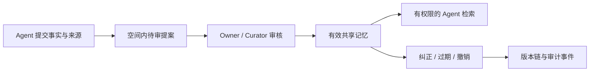

<p align="right"><strong>简体中文</strong> · <a href="./README.en.md">English</a></p>

# Memoria Agent

**一个可审核、可追溯、可授权给多个 Agent 使用的本地记忆系统。** 它让人决定哪些事实能成为共享记忆、谁能读取，以及何时纠正或撤销。个人 Agent 工作台仍可用来产生和检查记忆。

> Agent 提案 → 人工审核 → 按空间授权共享 → 冲突版本确认 → 撤销与审计

Memoria 默认本地运行，数据保存在 SQLite；只有聊天和自动提取等模型能力会请求你配置的 OpenAI 兼容服务。共享记忆治理 API 不依赖模型即可运行。

## 核心流程



共享层在检索与已知 ID 查询前检查空间权限；同主题变更必须确认当前版本，避免并发审批覆盖。个人对话产生的记忆使用独立审核队列，管理员可将有效个人记忆显式导入为共享提案。

## 你能做什么

- **治理共享记忆**：为 Agent 创建独立密钥和私有/共享空间；按 reader、contributor、curator 授权；提案须审核，批准前不会进入共享检索。
- **控制版本与生命周期**：同主题冲突需要显式确认被替代版本；过期、撤销与授权变更会立即影响共享检索，保留可审计的来源和事件。
- **审核长期记忆**：对话提取的事实和偏好先进入审核队列；查看原始消息、修改候选，再批准或拒绝。批准前不会参与召回。
- **检查并纠正**：在记忆库点击后立即打开独立编辑窗口；从来源 ID 跳回原始对话，查看版本链，填写原因后生成纠正版。旧版本保留，只有当前有效版本参与召回。
- **持续对话与工具**：多会话、流式回复、记忆召回、工具循环与 MCP；Dashboard 展示任务和 trace，Drift 可在空闲时运行限定技能。

## 快速开始

需要 **Python 3.11+**、**Node.js/npm** 和 Git；使用聊天或自动提取时还需要一个 OpenAI 兼容的模型接口。以下命令适用于 Linux/macOS；Windows 可使用 WSL。

```bash
git clone https://github.com/ZJ331456/Memoria-Agent.git
cd Memoria-Agent

python3 -m venv .venv
.venv/bin/python -m pip install -r requirements.txt
npm ci --prefix frontend
npm run build --prefix frontend
.venv/bin/python main.py
```

打开 <http://127.0.0.1:2237>。首次进入会提示配置主模型的 **Model、Base URL 和 API Key**；可以在页面中测试连接。快速模型和 Embedding 模型可稍后配置。未配置 Embedding 时仍可使用词面记忆检索。

想先体验共享记忆治理，可直接打开「共享治理」页；此流程不要求先配置模型。Agent 密钥只在页面内存中使用，刷新后需重新粘贴。

模型设置保存在被 Git 忽略的 `data/models.override.toml`，API 不回显密钥。也可以复制 `config.example.toml` 为 `config.toml`，用环境变量配置模型和运行选项。

## 第一次使用

### 共享记忆协作

1. 在「共享治理」创建 Agent，保存只显示一次的密钥；连接该身份后创建空间，创建者成为 owner。
2. 创建另一个 Agent，将其 ID 授权为 reader、contributor 或 curator。reader 检索，contributor 提交，curator 审核；owner 管理成员权限。
3. 提交内容、稳定的 `topic_key` 和来源。owner / curator 填写原因后批准或拒绝；涉及已有主题的变更需确认被替代版本。
4. 用其他身份检索已批准内容并查看版本链；owner / curator 可查看撤销后的审计记录。私有空间只允许 owner 使用。

### 个人记忆工作台

1. 在「对话」页告诉 Memoria 一项真实偏好或目标，完成一次对话。
2. 到「记忆 → 待审核候选」查看候选，点击「查看原始对话」核对上下文，修改候选后批准，或直接拒绝。
3. 在「记忆 → 有效记忆库」点击「检查并纠正」，编辑窗口会立即出现并聚焦内容输入框；填写修改原因后保存，新版本生效，旧版本留在时间线中。

「记忆 → 存储与任务」提供 Markdown 视图和后台抽取记录：`MEMORY.md` 从有效记忆生成，`SELF.md` 可由用户编辑并注入上下文。未保存的 Markdown 修改会暂存在当前浏览器标签页，保存文件后清除；旧的 `PENDING.md` 仍可查看，新的审核队列以 SQLite 为准。

旧聊天记忆与新共享空间分开存放；只有管理员显式导入并完成共享提案审核后，旧记忆才会出现在共享检索。当前多 Agent 隔离针对共享记忆接口，旧聊天运行时仍面向本地单用户。

## 可选能力

需要修改运行选项时，先执行 `cp config.example.toml config.toml`；修改后重启服务。

| 能力 | 开启方式 |
| --- | --- |
| 语义检索 | 在「设置」中配置 Embedding 模型；需要 SQLite 向量索引时运行 `.venv/bin/python -m pip install -r requirements-vector.txt` |
| MCP 工具 | 运行 `cp mcp_servers.example.json data/mcp_servers.json`，按需配置服务并在页面重载 |
| 空闲 Drift | 在 `config.toml` 的 `[agent.drift]` 下设置 `enabled = true`；默认关闭，可设置空闲阈值、静默时段、日预算和工具白名单 |
| API 访问限制 | 在 `config.toml` 的 `[server.security]` 下配置 `api_token`、允许的 Origin 和限流 |

运行数据默认位于 `data/`，服务默认只监听 `127.0.0.1:2237`。升级依赖后请重启服务。

## 代码导航

各目录 README 说明真实文件职责、调用关系、配置和验证入口：

| 目录 | 内容 |
| --- | --- |
| [memoria](memoria/README.md) | Python 服务、共享治理与个人 Agent 运行时；继续查看 lifecycle、prompting、memory、tools、MCP 等模块 |
| [frontend](frontend/README.md) | React 工作台、页面与 API、UI 组件、草稿和身份缓存规则 |
| [eval](eval/README.md) | 检索与治理评测、独立评分、容量和延迟基准 |
| [skills](skills/README.md) | 五个内置技能的使用说明、触发条件及 SKILL.md 编写约定 |
| [tests](tests/README.md) | 按能力选择回归测试、可选依赖与测试范围 |

## 开发与验证

```bash
.venv/bin/python -m pip install pytest
.venv/bin/python -m pytest -q
.venv/bin/python -m eval.run_governance
npm run build --prefix frontend
(cd frontend && npx playwright install chromium)
npm run test:e2e --prefix frontend
```

以上命令在仓库根目录运行。前端开发可另开终端运行 `npm run dev --prefix frontend`，Vite 会将 `/api` 代理到 `http://127.0.0.1:2237`。更多针对模块的命令见各目录 README。

## 评测

仓库提供 24 条无需模型的治理回归案例，以及独立的本地容量与延迟脚本：

```bash
.venv/bin/python -m eval.run_governance --min-pass-rate 1 --max-leak-rate 0
.venv/bin/python -m eval.benchmark_shared_memory --memories 1000 --spaces 10 --queries 200
```

治理评测分别报告授权召回、隔离泄漏、生命周期、冲突审核和来源对应。2026-10-02 的[归档样例](eval/results/README.md)为 24/24 通过、泄漏率 0；小型合成回归分数不代表真实场景的泛化能力，存储层延迟也不包含 HTTP 或模型调用。

公开数据可优先选择 [GateMem](https://github.com/rzhub/GateMem) 评估共享记忆的授权和遗忘，再用 [LongMemEval](https://github.com/xiaowu0162/LongMemEval) 的固定小样本评估知识更新与拒答，或用 [LoCoMo](https://github.com/snap-research/locomo) 的证据 ID 评估跨会话来源召回。本仓库尚未发布这些公开集的正式成绩。

## Related Projects

以下开源项目为 Memoria-Agent 的设计提供了参考；Memoria-Agent 是独立实现。

- [Pask](https://github.com/xzf-thu/Pask) — 主动式 Agent 与分层长期记忆。
- [akashic-agent](https://github.com/kachofugetsu09/akashic-agent) — Agent 运行时、记忆层与后台任务。
- [claude-mem](https://github.com/thedotmack/claude-mem) — 会话记录、压缩与跨会话上下文召回。
- [Holt](https://github.com/holt-os/holt) — 可查看来源的个人 Agent 记忆。
- [Mem0](https://github.com/mem0ai/mem0) — 面向 Agent 的记忆存储与检索。
- [Graphiti](https://github.com/getzep/graphiti) — 时序知识图谱框架，事实带有效期窗口与混合检索。
- [A-mem](https://github.com/WujiangXu/AgenticMemory) — Agentic Memory，自组织记忆笔记、关联与持续演化。
