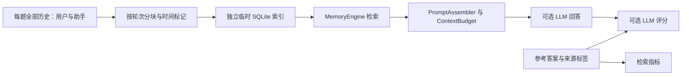

# LongMemEval：真实长历史检索与问答评测

[项目首页](../README.md) · [评测入口](../eval/README.md) · [归档报告](../eval/results/README.md)

## 数据与评测范围

项目已接入 [LongMemEval 官方数据格式](https://github.com/xiaowu0162/LongMemEval)。本次使用用户提供的 `data/benchmark/longmemeval_s_cleaned.json`（500 题）与 `longmemeval_s_cleaned_subset5.json`（5 题）；逐条核对后，子集与完整文件中的同 ID 样本完全一致。原始数据、向量缓存和运行日志均位于 Git 忽略的 `data/`，仓库只保存小型实验报告。

子集包含个人事实两题、偏好一题、时间推理一题、知识更新一题。**它没有覆盖 multi-session、single-session-assistant 与拒答样本，不能代表完整 500 题成绩。** LongMemEval 是公开对话记忆 benchmark；其中的对话并不意味着本项目收集了真实用户生产数据。[论文](https://arxiv.org/abs/2410.10813)

当前适配器执行以下实际链路：



该链路采用原始历史 RAG 索引，并未重放自动事实抽取、人工审批、情景生成、技能学习或共享 ACL。因此应将结果用于定位检索与回答问题；Memory Governance 和 Multi-Agent Shared Memory 的权限、版本、撤回与来源完整性仍通过 `run_governance` 独立评估。

## 是否需要 API

| 模式 | Embedding API | 回答 LLM | 评分 LLM | 可以评估什么 |
| --- | --- | --- | --- | --- |
| 默认命令 | 无 | 无 | 无 | 关键词检索与来源注入 |
| `--embedding` | 有 | 无 | 无 | 混合检索与来源注入 |
| `--qa` | 无 | 有 | 无 | 关键词检索后的实际答案；可人工或外部评分 |
| `--qa --judge` | 无 | 有 | 有 | 关键词检索、答案和自动判分 |
| `--embedding --qa --judge` | 有 | 有 | 有 | 混合检索、答案和自动判分 |

默认 reader 使用配置中的 `llm.main`，judge 使用 `llm.fast`；通过 `--reader-slot`、`--judge-slot` 选择 `main/fast`。Embedding 使用 `memory.embedding`。配置由 `Settings.load()` 读取，支持 `--config`、环境变量和已有模型覆盖配置；报告只记录模型名称与端点，不记录密钥。

5 题带评分的正常运行需要 5 次回答调用与 5 次评分调用，错误重试可能增加请求。Embedding 需要向量化每题全部历史分块和问题，成本主要来自历史索引。本次共 3185 个分块；默认单批最多 10 条，兼容当前 `text-embedding-v3` 服务限制。[供应商接口说明](https://www.alibabacloud.com/help/en/model-studio/text-embedding-synchronous-api)

向量缓存按协议、模型、端点和全部输入正文生成指纹，API key 不参与缓存标识。重跑相同配置可复用历史向量，但仍需问题向量、回答和评分调用。`embedding_calls` 统计逻辑批次、文本数与输入字符，不是重试后的 HTTP 请求总数，也不是供应商计费 token。reader/judge 的 `usage` 保留供应商返回值；字符预算并非精确 token 预算。

## 运行命令

在项目根目录安装 `requirements.txt` 后运行。默认就是上述 5 题文件，不会自动读取 500 题完整集。

```bash
# 离线来源召回；不调用模型
python -m eval.run_longmemeval \
  --out data/benchmark/results/longmemeval_subset5_lexical.json

# 关键词检索 + 实际回答 + 自动评分
python -m eval.run_longmemeval --qa --judge \
  --out data/benchmark/results/longmemeval_subset5_lexical_qa.json

# 混合检索 + 实际回答 + 自动评分
python -m eval.run_longmemeval --embedding --qa --judge \
  --out data/benchmark/results/longmemeval_subset5_hybrid_qa.json

# 完整 500 题：显式指定数据；先 --limit 5 可检查配置
python -m eval.run_longmemeval \
  --data data/benchmark/longmemeval_s_cleaned.json --embedding --qa --judge \
  --out data/benchmark/results/longmemeval_full.json
```

完整集需要为更多历史建立索引并调用模型；本次仅执行用户指定的子集，没有运行完整集。完整 JSON 目前一次性读入内存；500 题文件约 277 MB，解析后的内存占用更高。`--limit` 限制实际执行题数，不降低读取完整 JSON 的内存需求。

默认参数：`--top-k 10` 个分块、`--chunk-chars 1600`、`--context-chars 12000`、`--concurrency 2`、`--max-tokens 4096`。上下文最终还受项目 `context_char_budget` 限制。可设置 `--min-recall 0.8` 检查已成功完成检索案例的会话来源平均召回率；任意案例执行错误也会使 CLI 返回 1，参数或输入校验失败返回 2。执行失败不会被静默包装成成功的向量评测。reader/judge 必须提供正式 `content`，`finish_reason` 若存在必须为 `stop`；截断、仅有 reasoning 内容和空回复都记录错误。评分调用输出预算为 350，推理模型实际 usage 可能含额外推理 token。

每题完成后先写同名 `.cases.jsonl`，全部完成后生成完整 JSON；`--qa` 还生成 `.hypotheses.jsonl`。该 JSONL 使用官方所需的 `question_id/hypothesis` 字段。需要对齐官方答案评分时，在官方仓库的 `src/evaluation` 下运行：

```bash
python evaluate_qa.py gpt-4o /absolute/path/to/report.hypotheses.jsonl \
  /absolute/path/to/longmemeval_s_cleaned_subset5.json
```

官方评分需要额外的模型配置和 API 调用。当前内置 judge 根据题型标准独立编写中文量规，使用项目配置的 fast 模型，**并非官方 GPT-4o 评分原文或官方成绩**。参见[官方评分脚本](https://github.com/xiaowu0162/LongMemEval/blob/main/src/evaluation/evaluate_qa.py)。

## 防止评测标签泄漏

- `answer`、`answer_session_ids`、`has_answer` 和 `question_type` 只参与指标或评分，不参与检索、历史筛选或 reader 提示词。
- 原数据中有带 `answer_` 前缀的会话 ID。系统使用 `S0000:T0000:P000` 等位置 ID 替代，避免 ID 暗示正确来源；报告中的原始 ID 仅用于事后核对。
- 每题索引所有用户与助手轮次，保留原始时间，不使用答案标签挑选历史。
- 某些样本存在重复会话 ID、非时间顺序排列或清洗后的时间异常。加载器允许合法重复 ID，按原始位置区分分块，按原始会话 ID 去重评分，不擅自更改日期或排除历史。
- 每题使用独立临时数据库，结束后删除；不写入运行中的个人记忆库。

原始历史以独立 `benchmark_history` 类型进入索引，它遵循请求的 top-k，不受生产事实的四条类型配额限制；不表示这些原始轮次已成为人工批准的个人事实。当前直接调用 `MemoryEngine.retrieve`，不调用生产 LLM 查询改写，也关闭记忆图扩展。

## 指标如何阅读

| 指标 | 含义 |
| --- | --- |
| `retrieved_session/turn.evidence_recall` | 成功检索案例中，命中的标注会话/轮次数占全部标注来源的比例，再按题平均 |
| `injected_session/turn.evidence_recall` | 同样计算，但只看在最终上下文帧中仍可识别的来源 |
| `eligible_cases` / `requested_eligible_cases` | 已完成该阶段的适用题数 / 全部请求中的适用题数 |
| `evidence_recall_all_requested` | 未完成阶段按零计入，避免只展示成功案例带来的偏差 |
| `all_evidence_found_rate` | 该题所有标注来源都命中的比例 |
| `mrr` | 首个相关会话/轮次在去重排名中的倒数，再按题平均 |
| `fully_injected_chunks` | 正文完整进入最终上下文的分块数量 |
| `qa_accuracy` | 已得到有效评分的答案准确率 |
| `qa_accuracy_all_requested` | 正确答案数除以请求题数；评分/接口失败不能增加该分数；未请求评分时为 null |
| `errors` | 索引、检索、回答或评分失败的题数 |

没有 gold 来源或 ID 以 `_abs` 结尾的题不计来源召回；拒答题仍可进行问答评分。来源 ID 出现只表示来源命中，**不保证实际答案文字位于命中的分块内或未被截断**。因此会话来源召回 100% 不等于答案准确率 100%。当前会话/轮次指标从分块排名映射得到，与官方 session 检索协议、`recall_all@K`/`ndcg_any@K` 不同，不应直接横向比较。

## 本次实测与下一步

2026-10-09 的 5 题输出归档至 [longmemeval_subset5.json](../eval/results/longmemeval_subset5.json)，包含数据 SHA256、固定参数、模型、逐题回答和判分以及失败尝试说明。详细数字与适用范围见[报告导航](../eval/results/README.md)。

最终两种方案采用相同的 4096 输出预算：

| 方案 | 会话来源召回 | 标注轮次召回 | 自动判分 | 执行错误 |
| --- | --- | --- | --- | --- |
| 关键词 + reader/judge | 100% | 90% | 5/5 | 0 |
| 混合检索 + reader/judge | 100% | 100% | 4/5 | 0 |

**自动判分不等于经核实的答案准确率。** 关键词方案偏好题依然拒绝提供建议，judge 却判为正确，疑似误判；初次 1200 预算的关键词运行曾判为 4/5。混合方案提供了酸奶相关技巧，judge 对是否充分个性化判为错误，同样应复核。两种方案的其余 4 题均明确给出事实参考要点。当前不能据此认定关键词优于混合检索，也不能将 5/5 宣传为稳定准确率。

首次向量运行因 16 条批量超过供应商 10 条上限失败；修复后建立全部历史索引。其后发现 1200 输出预算下偏好题返回截断推理文本，已排除该次名义判分，并增加正式 content/完成状态校验。最终比较使用相同 4096 预算重跑，没有按答案调整检索或提示词。报告记录这些步骤。

建立索引的未缓存运行共 326 个逻辑 Embedding 批次、3190 段输入（3185 历史分块 + 5 问题）；最终混合运行命中 5 题全部历史缓存，仅额外请求 5 个问题向量。最终两次问答各包含 5 次 reader 和 5 次 judge 调用；详见报告 `totals`。两种运行耗时不能用于比较冷启动性能。

应在额外保留的未见样本上检验邻轮补全、偏好回答策略与时间检索改进，并通过官方 judge 或独立人工复核处理评分争议，避免反复针对这 5 个答案调参。

要评估分层治理的贡献，下一步应建立原始历史 RAG、经过同一预算的语义记忆、语义加情景三组对照；自动提取和人工审核需要记录额外成本与召回损失。公开长历史问答集缺少共享授权标签，权限与撤销评估应继续使用治理案例或接入适合共享记忆的数据集。
