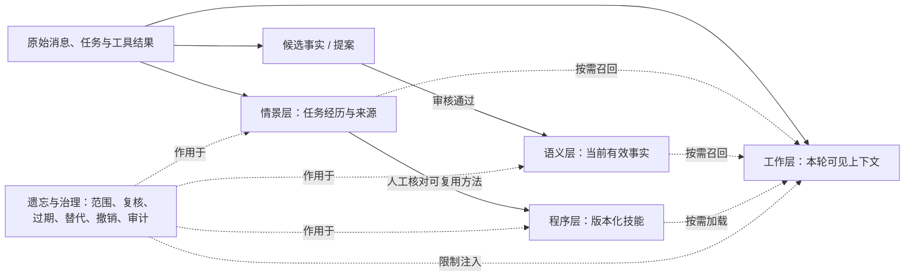

# 记忆分层：从上下文到可治理的长期知识

[文档导航](../README.md) · [调研来源与数字核验](调研来源.md) · [个人记忆模块](../../memoria/memory/README.md) · [共享治理](../记忆治理与多Agent共享记忆.md)

本文参考用户提供的 *Agent Memory - The 5-Layer Playbook*，将其中有用的工程思想改写为 Memoria-Agent 的设计说明。该 PDF 是独立汇编，并非 Anthropic 官方规范。CoALA 原论文区分**工作记忆**与**情景、语义、程序性长期记忆**；本文把“遗忘”列为第五项，是为了单独说明贯穿各层的生命周期治理，并非声称 CoALA 定义了第五种记忆。[原始来源及性能数字的适用范围](调研来源.md)单独列出。

## 一张图看数据如何流动



这些箭头是**可选择的写入和读取路径**。一条消息不会自动依次升为情景、语义和程序性记忆；事实候选需要审核，技能需要可重复的成功证据和人工确认。原始消息与审计记录是追溯依据，摘要和检索命中只是派生视图。

## 五项职责

| 项目 | 保存什么、放在哪里 | 如何读取 | 生命周期与边界 |
| --- | --- | --- | --- |
| 工作层 | 当前目标、约束、最近消息、必要工具结果、会话摘要以及选出的长期记忆，组成模型本轮可见的上下文；还包括运行时的活动状态，不只是模型的 context window。 | 每轮按任务装配，设预算与优先级；大段历史改用摘要或按需查询。 | 本轮结束后释放临时内容；保留原始消息，增量压缩较早对话，避免覆盖关键约束。 |
| 情景层 | 发生过的任务、结果、错误、纠正、时间和来源指针；原始会话仍由消息表保存，短情景记录是可检索的任务摘要。 | 用当前任务检索相似经历，先从少量结果开始，必要时跳回原始消息或 trace。 | 过期或超量时软归档；置顶保护；来源删除时遵循外键级联，取消或“完成”记录不能自动当作成功证据。 |
| 语义层 | 经确认的事实、偏好、目标、实体关系，以及状态、有效时间、来源和版本。个人记忆在 SQLite；跨 Agent 共享事实在独立空间中。 | 个人事实只召回当前有效版本，自动候选批准后生效；共享事实另需空间授权、批准与有效期检查。旧版用于有权的沿革查询。 | 去重、强化、替代、纠正、过期和撤销各有不同含义；冲突先进入审核，不靠“新内容覆盖旧内容”。 |
| 程序层 | 可复用的方法、前提、步骤、所需工具、成功条件和失败模式；项目沿用 `SKILL.md`。 | 按任务选择少量技能，只把需要的内容注入本轮；记录加载的版本指纹和 trace。 | 人工审查后发布或修改；保留版本证据，环境变化时重新验证。多次成功只是待评审信号，不自动发布技能或改写代码。 |
| 遗忘与治理 | 跨层规则和审计，而非另一份“所有记忆”的副本。 | 在读取、写入和维护任务上执行范围与状态过滤。 | 区分不再召回、软归档、版本替代、权限撤销与真实删除；可追溯历史和隐私删除是不同需求，需分别处理。 |

### 1. 工作层：把有限上下文留给当前决策

本轮输入包括系统指令、用户最新请求、最近会话、工具输出，以及从其他层取回的少量证据。系统应保存活动目标、约束、已做决定和下一步；低价值的旧工具输出可清除或压缩。工作记忆还可包含运行时状态和指向原始证据的 ID，因此不能简单定义成“整段提示词”。

Memoria 的 [`PromptAssembler`](../../memoria/prompting/assembler.py) 将身份提示与检索到的上下文分开。长会话由 [`SessionCompactor`](../../memoria/runtime/compaction.py) 对滑出活动窗口的消息做**增量摘要**：旧摘要、下一段旧消息和来源游标共同更新，保留目标、约束、关键决定和消息来源；原文仍留在会话存储。摘要可能遗漏信息，重要事实仍须回查原始消息。压缩触发与预算应根据本项目的模型、对话长度和评测调整，PDF 的“达到窗口 85% 就压缩”不是通用阈值。

### 2. 情景层：记住做过什么及其结果

情景记录宜简短：任务描述、完成/失败/取消状态、结果或错误摘要、时间、来源消息与 trace。它服务于“上次类似任务尝试了什么”，也让用户能回看证据；它不要求保存冗长的模型推理或把整份外部文档再复制一遍。

本轮在个人 SQLite 中实现 `memory_episodes`，任务正文上限 600 字符、结果上限 1200 字符，来源通过外键关联原始消息，删除来源时级联清理对应情景。`EpisodicMemory` 从当前任务检索最多 3 条；默认 90 天或活动记录超过 1000 条后定期**软归档**，置顶记录受保护。这里的 90 天和 1000 条是待评测的单机起点，不是认知规律或其他系统的最佳值。`completed` 只表示流程结束，若缺少可核对的成功条件，不能作为技能晋升的成功样本。

### 3. 语义层：保存当前可信的事实

个人自动提取先写入 [`memory_reviews`](../../memoria/memory/README.md)，用户批准后才进入有效个人记忆；手动纠正产生新版本，旧版本和原因可追溯。共享层另有 Agent 身份、空间授权、提案、审核理由、同主题条件替代和审计事件。共享提案批准前不参与检索。内容的来源 ID 表示“可以追溯到哪里”，**不等于来源已被自动验证**。

语义记忆是事实与知识的类别，不等于向量检索。Memoria 已有 SQLite、FTS、可选向量索引、实体关联和有效时间字段；对当前单机项目，先复用这些结构与少量稳定主题键，不需要仅为“第三层”另起完整知识图谱。事实变化时，保留旧版并记录为什么替代；两条都可能成立时，标记冲突供人审核。

### 4. 程序层：复用经过验证的方法

程序性记忆可以表现为技能、提示词和执行规则；本项目沿用 [`skills/`](../../skills/README.md) 中的 `SKILL.md`。自动选择按任务触发词与依赖可用性匹配；按名称调用 `load_skill` 只检查技能是否可用，不另外校验任务相关性。在 trace 中记录实际加载的名称和版本指纹，便于复盘“当时按哪个方法做的”。

PDF 提出的“每周出现且成功三次就晋升”可作为寻找候选方法的启发，但不是自动发布规则。需要人工核对不同情景的成功证据、失败模式、适用环境和可回滚版本；本轮**不实现自动成功晋升**。程序层的更新可能改变 Agent 行为，审查门槛应高于普通事实写入。

### 5. 遗忘与治理：让失效内容退出使用路径

“遗忘”至少包含四种不同动作：临时上下文不再注入、旧情景软归档、被新事实替代的版本退出当前检索、到期或撤销的共享记忆不再对普通成员返回。隐私删除则可能要求连原始来源或历史一起处理，不能把“停止召回”说成“彻底删除”。置顶只保护符合用途的情景记录，不应绕过空间 ACL 或撤销状态。

治理优先在**读路径**执行：每次按身份和空间检查授权，过滤待审、已替代、已撤销或到期的内容；再按相关性和预算选择结果。维护任务负责定期归档、复核和记录原因。用户纠正和共享审核优先于模型自行判断，来源与版本链保留可追溯性。

## 热、温、冷是工作状态，不是固定毫秒数

| 逻辑状态 | 例子 | 读取方式 |
| --- | --- | --- |
| 热 | 最新请求、活动目标、少量已选证据 | 已装入当前轮次上下文 |
| 温 | 当前有效的个人事实、可用技能、近期情景 | 按查询和权限取回 |
| 冷 | 已归档经历、旧版本、原始消息与审计历史 | 明确追溯、复核或恢复时查询 |

同一记录的“热度”随任务变化，并不等于指定的存储介质或延迟 SLO。PDF 给出的热/温/冷毫秒值不能直接视为本项目测得的性能。冷数据可能因新问题重新进入工作层；共享空间中的旧版本仍须受 ACL 保护。

## 多 Agent 的共享边界

个人聊天的 SQLite 记忆与受控共享空间是两个数据域。共享 Agent 必须带身份并指定空间；`reader` 只读、`contributor` 可提案、`curator` 可审核治理，空间 owner 管理授权。后台处理、工具调用和搜索也要传递明确的 Agent/空间上下文，不能因为同机存储就绕过权限。当前独立 `/api/shared/*` 治理服务具有这些边界；旧聊天 runtime 的个人检索**不应被描述为已经具备多 Agent 隔离**。

共享读写应遵守：先授权，再查询；候选不直接公开；审批时校验当前版本，冲突返回重新审核；撤权后新请求无法通过旧 ID 读到正文。Agent 已读取或复制到外部系统的内容，服务端撤销无法倒回。更详细的现状见[共享治理专题](../记忆治理与多Agent共享记忆.md)。

## 这轮实现的配置起点

以下数值已落实于配置模板，用于先建立可重复的本地基线，再通过长会话、来源追踪、隔离与成本评测调节；它们不是全局最优配置。

| 控制项 | 起点 | 用途 |
| --- | ---: | --- |
| 活动会话窗口 / 全局字符预算 | 40 条消息 / 60,000 字符 | 保留近期上下文；较早消息增量摘要。 |
| 上下文分区限额 | 语义 3,000、情景 1,800、程序 2,400、摘要 2,000、目录 1,200、SELF 1,200 字符 | 合计 11,600 字符，为标题和元信息留空间；整份 context frame 上限 12,000 字符。 |
| 情景检索 | top 3 | 先少量召回，命中不足再用来源查询。 |
| 情景活跃保留 | 90 天 / 最多 1,000 条 | 到期或超量软归档；置顶保护。 |
| 每轮记忆读取工具 | 最多 6 次，初始帧与返回内容合计 12,000 字符 | 控制 `recall_memory/recall_episodes/search_history/load_skill` 的重复读取；写入仍走原有授权。 |
| 普通匹配技能注入 | 最多 2 个，always 技能另行选择 | 延续当前 [`config.example.toml`](../../config.example.toml) 的起点。 |

可复制到 `config.toml`（修改后重启），或沿用模板默认值：

```toml
[memory.layers]
enabled = true
episodic_enabled = true
semantic_chars = 3000
episodic_chars = 1800
procedural_chars = 2400
summary_chars = 2000
catalog_chars = 1200
self_chars = 1200
context_chars = 12000
episode_ttl_days = 90
episode_top_k = 3
episode_max_active = 1000
maintenance_interval_seconds = 3600
retrieval_max_calls = 6
retrieval_max_chars = 12000
```

字段拒绝未知项、错误类型与越界值，布尔开关不接受整数。`enabled=false` 关闭新增分区和读取配额，`episodic_enabled=false` 只关闭情景捕获/召回/维护；原有事实审核与版本仍可用。原始资料并未证明所有应用使用同一组数值最优，此处的选择侧重单机项目的可追溯性与有界开销。

## 检查、回放与评估

1. 正常完成一次聊天，在 `GET /api/episodes` 查看记录，取 `user_message_id` 调用 `GET /api/messages/{id}/source` 回到原始会话。completed 仅说明回合已结束。
2. 对重要任务发送 `PATCH /api/episodes/{id}` 的 `{"pin":true}`；对不再需要的经历发送 `{"archive":true,"reason":"用途已结束"}`。使用 `status=archive/all` 回放历史，管理详情不改变召回状态。
3. `POST /api/episodes/maintenance` 的 `{"dry_run":true}` 先显示过期/超量候选，`false` 才实际软归档；固定记录受保护。当前情景管理通过 API 或 `/docs`，没有独立前端页面。
4. `GET /api/memory-layers` 查看配置与规模；turn trace 的 `memory_layers/memory_tool_budget/episode_retrieval/skills` 说明装配裁剪、读取额度、来源和技能版本。trace 不自动作为下一轮事实。

接口参数和全局 Token 的要求见[API 文档](../API接口文档.md)。删除会话会级联消息/情景/摘要，并清理抽取任务与审核候选；已批准事实、来源操作账本及诊断 trace 仍需各自的保留/删除策略。事实审批在最终写入事务中复核来源，防止异步模型处理期间来源删除后仍发布新事实。

```bash
python -m pytest -q tests/test_episodic_memory.py tests/test_layered_context_budget.py \
  tests/test_incremental_compaction.py tests/test_memory_layers_integration.py
python -m tests.regression.run_memory_layers --min-pass-rate 1
python -m tests.regression.run_governance --min-pass-rate 1 --max-leak-rate 0
```

自定义分层回归已经迁至 [tests/regression](../../tests/regression/README.md)，旧合成分数报告已从 eval 移除。公开评测使用 [LoCoMo 的五题实际历史](../../eval/results/README.md)测量语义、情景、联合及最终注入证据，以及 reader/judge 输出。该样本没有证明情景层提高来源召回；技能、TTL、容量与并发仍由工程测试验证。

下一步调优先固定留出集与模型，比较情景开关、会话窗口 20/40/80 与语义 top-k 4/8/12；保持来源、审核和权限规则一致，每次只改变一个因素。摘要覆盖 ID 表示原文已读入，摘要本身仍有损；当前完整前缀校验与覆盖 JSON 重写的开销随历史长度增长，尚未保证长期大库的常数时间压缩。

评测应分别报告：有证据的问题回答正确率、来源 ID 对应率、撤权后泄漏率、记忆更新与遗忘正确率、注入 token、维护开销及延迟分布。对比至少包括“无新增情景层”和“启用情景层”，并区分检索时间、回答时间和后台构建时间。Mem0 与 Snowflake 的公开数字属于它们自己的实验，不能承诺 Memoria 会节省 90% token 或获得同等准确率提升。[数字核验](调研来源.md)给出原始实验边界。
