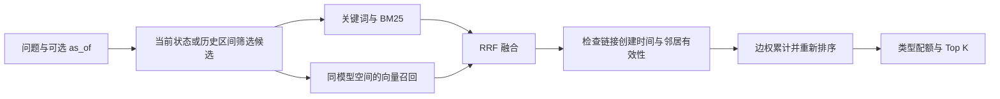

# 记忆一致性与检索审查

[文档导航](README.md) · [个人记忆模块](../memoria/memory/README.md) · [共享治理](记忆治理与多Agent共享记忆.md)

本次对照用户提供的深度审查文本检查当前代码，优先修复版本一致性、历史召回、来源完整性和向量迁移。审查建议经实际复现后采纳，不将文档中的推测直接视为已发生故障。

复核日期：2026-10-09。实现提交：`594aba6`（个人记忆）、`474dd7d`（共享来源与检索）、`a27b80a`（生效区间展示）。

## 1. 审查意见与处理结果

| 问题 | 当前实现 | 验证与边界 |
| --- | --- | --- |
| S1 / S2：纠正、替代与有效时间分两次提交 | Store 在同一事务内写新版本、关闭旧区间、建立新有效区间、更新 FTS/向量索引并记录替代关系 | 故障注入验证全部回滚；失效目标明确抛出版本冲突，HTTP 返回 409 |
| S3：省略参数会清除失效时间 | `set_temporal` 用哨兵区分省略与显式 `None`，只编辑最新区间；时间统一转成 UTC | 时区等价、结束边界、非法日期与局部更新回归 |
| S4：撤销恢复后历史错误 | 新增 `memory_validity_intervals`；撤销关闭当前区间，恢复旧版本时追加区间 | 保留 A → B → A 的完整有效时间；跳过来源已撤销的中间版本 |
| S5：同一来源重复强化 | 写事务内检查来源账本，重复或已撤销来源不会重复加权 | 两个数据库连接并发处理同一来源；无来源的人工强化仍可重复执行 |
| S6：切换模型清空旧向量 | `memory_embeddings` 按记忆 ID、模型命名空间和维度保存；sqlite-vec 使用独立索引表 | 同维度不同模型不混用；旧向量保留、切回可用、重启可恢复；无 sqlite-vec 时使用 JSON |
| E1：图扩展只追加、不重排 | 按边权累计来自不同种子的分数，对已有候选也加分，随后重排 | 图扩展仍为轻量启发式，未证明真实 benchmark 上有收益 |
| E2：历史查询绕过混合检索 | 在候选阶段筛选有效区间，再执行词面、BM25、可选 Dense、RRF 和图扩展 | 历史 Dense 在受时间约束的候选内扫描，不调用只面向当前状态的 KNN |
| E3：BM25 的 TF 固定为 1 | 保留重复词元，用 Counter 计算词频，文档长度按词元数计算 | DF 按文档计数；中文仍使用字符二元组，非完整中文分词器 |
| E4：简单冲突规则易漏判或误替代 | 同一语句骨架支持数值变化；否定翻转须主体和对象一致；自动路径保护人工纠正 | 仅限已召回的可变类型，不是通用属性抽取或 NLI |
| Evolve：补充不保证版本替代 | 用户显式演化走纠正事务，旧版失效，新版带替代关系 | 当前仍是旧内容与补充内容的拼接，不宣称自动知识重写 |
| Backfill：异常批次可能部分写入 | 整批校验数量、维度、有限数值、非零向量；事务批量保存 | 模型热切换时丢弃旧回填批次；显式写入保留生成向量的原模型身份 |
| G1：来源 ID 只检查是否填写 | 提案与批准事务均检查本地消息、会话和有效旧记忆是否存在 | 外部引用不自动下载或核验；人工输入不伪装成已验证证据 |
| G2：共享只支持完整子串 | ACL/状态/有效期先约束 SQL 候选，长问题或多词查询支持词元召回和 BM25 | 连续且不超过 8 字符的短语保留子串匹配；共享层尚无 Dense |
| G3：来源存在不等于事实正确 | 明确保留人工核对和审核职责 | Evidence Span / NLI 支持度验证仍待实现，不能称为来源事实已验证 |

## 2. 版本生命周期的时间语义

每个有效区间采用 **`[valid_at, invalid_at)`**：生效时刻包含，失效时刻不包含；`invalid_at=null` 表示没有已记录的结束时刻。输入支持 ISO 8601，带时区时间统一转换为 UTC，无时区输入按 UTC 解释。

例如：

| 时间 | 事件 | 查询当时的记忆 |
| --- | --- | --- |
| T1 | 创建 A | A |
| T2 | B 替代 A | B |
| T3 | 撤销 B 的来源，恢复 A | A |

A 保存 `[T1,T2)` 和 `[T3,∞)` 两段区间，B 保存 `[T2,T3)`。撤销不会抹掉 B 曾经生效的事实，也不会把 A 的历史改成始终有效。`memories.valid_at/invalid_at` 表示**最新区间**，详情接口的 `validity_intervals` 返回完整区间；历史查询返回当时匹配的区间，并关闭当前强化次数对历史排序的加分。前端纠正窗口展示多段生效记录。

`status` 用于当前版本管理。历史检索通过区间表判断有效性，因此可以返回如今已经被替代的历史版本。默认检索仍只读 active 记忆。永久删除会删除记忆和对应区间；需要保留历史时使用纠正或来源撤销。

本实现是**有效时间区间 + 操作审计时间**，尚不支持独立的 `recorded_as_of` 查询，不能等同于完整双时态数据库。用户的历史正文修改应走纠正事务，不能原地改写旧版本。

## 3. 历史检索与图扩展



当前 KNN 索引只服务当前有效版本；历史 Dense 使用同模型向量在历史候选内计算余弦相似度，避免先取当前全局 Top K 再过滤时间。图扩展仅使用查询时点之前建立的链接，不能沿无效邻居继续遍历。

个人 FTS 种子最多 200 条，JSON/历史扫描受 `vector_scan_limit` 限制；图扩展使用前三个种子的一跳邻居，各最多三条。共享查询最多取 2000 条授权匹配候选，再计算 BM25。超出这些窗口的召回率、大规模索引和分页仍需后续设计。

## 4. 模型切换与数据库升级

- 模型命名空间由 Embedding 的模型名和服务地址生成指纹，不包含 API Key；API Key 轮换不改变空间。同一别名的服务端模型版本变化仍需运维侧识别，不能仅靠指纹自动发现。
- 原模型、原维度的向量保存在独立记录/索引中。切换模型后，当前空间没有的向量视为待回填；历史向量不因维度变化被整体清空。
- 设置页面热切换模型后更新客户端与命名空间；请求使用生成向量时的模型身份。回填会检查切换，防止把旧模型返回值标成新模型。
- `POST /api/memories/reindex` 只补当前模型缺失或与当前索引维度不符的活动记忆，默认仍有批量上限。没有实施后台蓝绿迁移或全量覆盖校验，不能声称切换后全部记忆立即获得 Dense 召回。
- 旧库启动时自动建立区间表和向量版本表。缺失的有效时间以创建时间、替代记录时间和可用的撤销账本回填；已有区间不重复迁移。旧版本未记录的多次恢复、精确失效时间或已被清空的向量不能凭空恢复。
- 生产数据升级前保留 SQLite 一致性备份。首次迁移和向量索引初始化存在启动开销；旧索引表不自动删除，可在独立维护流程中清理。

## 5. 剩余优化优先级

1. **来源支持度验证**：让提案附带可定位的 evidence span，区分“来源存在”和“来源支持事实”；再评估规则或 NLI，最终由治理者审核。
2. **共享召回接入运行时**：为聊天、工具、缓存和来源访问传递显式 Agent/Space 身份，再将共享检索接入 runtime。当前 ACL 只保护独立共享 API。
3. **结构化知识更新**：抽取主体、属性、值与事实时间，处理人物归属、单位、有效期和更新冲突；当前字符相似候选及规则不足以覆盖全部更新。
4. **有证据的检索调优**：后续固定公共集与模型，比较关闭图扩展、BM25、时间约束的结果。现有公开五题结果仍是此前运行的观察，本轮没有重跑或声称准确率提升。

评测模块已有 LongMemEval、LoCoMo、GateMem 公共适配与固定五题报告，本轮保持这些数据和报告。新增机制验证属于 `tests/` 的工程回归，不回写成公开 benchmark 分数。

## 6. 验证入口

```bash
python -m pip install -r requirements-vector.txt
python -m pytest -q tests/test_memory_consistency.py tests/test_embedding_client.py \
  tests/test_review_source_transactions.py tests/test_store_transactions.py \
  tests/test_governance_core.py tests/test_governance_consistency.py tests/regression/test_governance_eval.py
python -m pytest -q
npm run build --prefix frontend
npm run test:e2e --prefix frontend -- --grep 'memory timeline|memory correction'
```

`test_memory_consistency.py` 覆盖版本原子回滚、结束边界、时区、恢复区间、并发强化、历史融合、加权图排序、模型隔离与迁移和回填故障；本地共享来源失效与授权排序由 `test_governance_consistency.py` 验证。可选 sqlite-vec 未安装时对应测试跳过；本次安装后同时验证 JSON 与真实 sqlite-vec 路径。测试结果以发布时实际命令输出为准。

本次验证结果（代码状态 `a27b80a`）：

| 命令 | 实际结果 |
| --- | --- |
| `python -m pytest -q` | 182 passed，无跳过；包含公共适配器与工程回归 |
| `npm run build --prefix frontend` | TypeScript 与 Vite 构建通过 |
| `npm run test:e2e --prefix frontend -- --grep 'memory timeline\|memory correction'` | 2 passed；Mock API 下的纠正、恢复区间及移动布局流程 |

本轮未重新运行公共数据集模型评测，这些验证不能用作新的回答准确率或检索收益结论。
