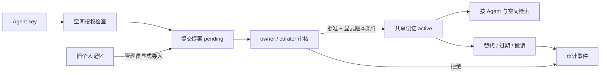

# 记忆治理与多 Agent 共享记忆

## 定位与已实现边界

Memoria 的聊天功能用于产生和使用个人记忆；新增加的共享记忆层面向多个 Agent 协作时的**受控事实库**。它把「谁提出、谁审核、谁能读、何时失效、为什么替换或撤销」作为数据模型的一部分。共享层可以独立于聊天调用，不需要模型服务即可运行。

当前实现是单机 SQLite、HTTP API 和本地治理工作台。它提供 Agent 独立密钥、空间与角色授权、先提案后发布、同主题版本冲突保护、有效期、撤销、来源指针和审计事件。它尚未将旧聊天运行时的全局 `memories` 检索改成多 Agent 检索。因此**隔离保证只适用于 `/api/shared/*` 与 `MemoryGovernance`**；旧 `/api/memories`、聊天工具、Markdown 导出和时间旅行接口仍是本地单用户数据域，不应用作多租户共享入口。



## 数据与决策规则

| 对象 | 关键字段 | 规则 |
| --- | --- | --- |
| Agent | `id`、`name`、密钥哈希、`enabled` | 原始 key 创建时只返回一次；禁用后立即失去权限；管理员可轮换 key 恢复身份和原有空间权限。 |
| Space | `id`、`owner_agent_id`、`visibility` | `private` 只供所有者使用；`shared` 可授权其他 Agent。 |
| Grant | `space_id`、`agent_id`、`role` | `reader` 读当前记忆；`contributor` 可读并提交；`curator` 可读、提交、审核、撤销、看事件；只有 owner 管理授权。 |
| Proposal | 内容、类型、主题键、来源、有效期、状态、审核者与原因 | 所有写入先进入 `pending`；审批/拒绝不可重复处理。 |
| Governed memory | 内容、空间、主题键、版本、前驱、状态、来源 | 只召回已批准且当前有效的版本；旧版本保留供授权者查看版本链。 |
| Event | actor、动作、目标、原因、时间 | 记录授权、提案、审核、替代、撤销等治理动作；仅 owner/curator 可查。 |

`topic_key` 是同一空间内的稳定事实主题，例如 `project:alpha:database`。内容、类型、重要度、来源类型、来源 ID 或有效期发生变化时，审批方必须传入当前版本的 `expected_replaces_id`；它与当前版本不一致时返回 409，要求重新审核。完全相同的提案可确认已有版本。这样避免一个审核者覆盖另一审核者刚批准的更新，也防止来源或有效期更新被当成重复内容忽略。待审列表返回实时 `conflict_memory_id`，并保留提交时的 `submitted_conflict_memory_id`，供核对期间发生的变化。

审批事务会重新验证提交者仍启用、仍有该空间的提交权限；失权提案不能发布，治理者可以拒绝它。**来源指针是可追踪元数据，不等于自动验证过的证据。** `legacy_memory` 导入时和审批时均检查旧库来源存在且有效；其他 `source_type` 的真实性仍需审核者判断。

过期和撤销的记忆不进入共享检索；撤销当前版本会同时撤销该空间同主题的旧版本，普通成员不能用历史 ID 找回正文，治理者仍可审计。过期的过滤立即生效；审核详情和版本链用 `effective_status=expired` 表示过期，持久化状态和 `expire` 事件在后续同主题审批时写入，目前没有定时过期清理器。空间授权先于搜索与 ID 详情检查，未授权 Agent 无法借由记忆 ID、版本链或审计接口绕过隔离。私有空间不接受其他 Agent 的授权。

## 一次协作流程

以下命令以已配置 `[server.security].api_token` 为例；默认本地部署未配置时，管理员接口只允许回环地址访问。将返回的 Agent key 放在受保护的密钥管理位置，前端只在当前页面内存中保留粘贴的 key。

```bash
curl -X POST http://127.0.0.1:2237/api/governance/agents \
  -H "Authorization: Bearer $ADMIN_TOKEN" -H 'Content-Type: application/json' \
  -d '{"name":"research-agent"}'
```

响应中的 `token` 只在创建时出现。以该 key 调用 `/api/shared/*`：

```bash
curl -X POST http://127.0.0.1:2237/api/shared/spaces \
  -H "X-Agent-Key: $AGENT_KEY" -H 'Content-Type: application/json' \
  -d '{"name":"项目决策","visibility":"shared"}'

curl -X POST http://127.0.0.1:2237/api/shared/proposals \
  -H "X-Agent-Key: $AGENT_KEY" -H 'Content-Type: application/json' \
  -d '{"space_id":"<SPACE_ID>","content":"Alpha 项目使用 PostgreSQL","topic_key":"alpha:database","source_type":"external","source_ref":"ADR-7"}'

curl -X POST http://127.0.0.1:2237/api/shared/proposals/<PROPOSAL_ID>/approve \
  -H "X-Agent-Key: $OWNER_OR_CURATOR_KEY" -H 'Content-Type: application/json' \
  -d '{"reason":"已核对 ADR-7"}'

curl 'http://127.0.0.1:2237/api/shared/memories?space_id=<SPACE_ID>&q=PostgreSQL' \
  -H "X-Agent-Key: $READER_KEY"
```

另一个 Agent 必须由 owner 经 `/api/shared/spaces/{id}/grants` 授予 `reader`、`contributor` 或 `curator`。把旧个人记忆移入共享空间时，管理员调用 `/api/governance/spaces/{space_id}/import-memory/{memory_id}` 并提供 owner 的 `actor_id`、`topic_key`；结果仍是待审提案，不会自动公开旧内容。

Agent key 丢失或泄露时，管理员调用 `POST /api/governance/agents/{agent_id}/rotate-key`。新 key 只返回一次，旧 key 立即失效；禁用的 Agent 会恢复启用，空间成员关系保持可管理。禁用与轮换会在关联空间留下管理员事件。工作台切换身份、切换空间或遇到失权响应时清空已加载内容，防止刷新后继续展示失效的本地缓存。

## 安全和容量边界

- `[server.security].api_token` 保护管理员与旧 API；Agent key 只用于 `/api/shared/*`。配置全局 token 时，带 `X-Agent-Key` 的共享路由由空间 ACL 单独认证；Agent key 不能访问旧个人记忆或管理员接口。
- 默认仅监听 `127.0.0.1`。公开部署应配置全局 token、TLS/反向代理和可信的网络边界；反向代理若把远端请求作为本机连接转发，不能依赖「回环地址管理员」例外。
- 共享检索目前是 SQLite 词面匹配与结果限制，适合小型团队知识库；还没有共享层的向量索引、跨节点并发部署、细粒度字段脱敏或 Agent 间来源证明。
- 撤销防止共享层再次检索，却不能让已被外部 Agent 复制到其提示词、日志或其他系统的数据消失。它也不清理旧聊天记忆，因为两层尚未合并。

## 评估：先测治理，再测记忆能力

仓库内 `eval/governance_cases.json` 提供 24 条合成案例，覆盖授权召回、跨空间泄漏、已知 ID 直查、授权撤销、过期、记忆撤销、版本替代、冲突提案、越权写入和来源对应。`python -m eval.run_governance` 用临时 SQLite 运行真实治理层并评分；`python -m eval.governance_eval <predictions.json>` 可评估其他实现的预测。重点指标是 `isolation_leak_rate`、`authorized_recall_at_k`、`lifecycle_accuracy`、`conflict_review_accuracy`、`source_exact_match_rate`。这组案例是回归测试，不是对真实数据或完整 LLM 系统的泛化结论。

本地容量与延迟可独立运行：

```bash
python -m eval.benchmark_shared_memory --memories 1000 --spaces 10 --queries 200
```

2026-10-02 的本机样例结果：24/24 治理案例通过，隔离泄漏率 0；1000 条记忆分布在 10 个空间，200 次授权检索的 p50/p95 为 **0.070/0.080 ms**，详情 p50/p95 为 **0.026/0.031 ms**，跨空间显式检索与详情分别 200/200 被拒绝。构建种子数据耗时 2935 ms，单独于查询统计。原始报告保存在 `eval/results/`。

这些延迟来自单进程 SQLite 存储层、已初始化缓存和每空间约 100 条合成记录，不包含 HTTP、模型、向量检索、并发请求或跨机网络，不能作为线上 SLO。治理单元测试另外覆盖两个独立数据库连接的并发审批、元数据修改、失权提案、旧版本撤销、密钥恢复及来源失效。

本轮验证包括：后端全量回归 **86 passed、1 skipped**（跳过可选 sqlite-vec 测试）；前端 TypeScript/Vite 构建通过；Playwright 浏览器回归 **9 passed**。最后的数据库兼容修复另外增加了两条并发回滚用例：旧记忆引擎创建和替代记忆时，元数据写入必须等待治理事务结束，不能提前提交共享连接上的审批操作。治理事务、旧库元数据写入和向量索引状态读取共用 `Store.lock`。

公开数据集建议按以下顺序接入：

| 数据集 | 合适的用法 | 限制 |
| --- | --- | --- |
| [GateMem](https://github.com/rzhub/GateMem) | 最贴近多主体共享记忆治理；官方提供 91 个长篇 episode、2,218 个检查点，区分授权效用、访问越界和主动遗忘。先接一个领域的输入适配器，保留官方评测格式。 | 完整比较包含 LLM 回答/评审成本；本仓库当前尚未跑官方分数。 |
| [LongMemEval](https://github.com/xiaowu0162/LongMemEval) | 从 500 个问题中固定抽取 20–50 条 `knowledge-update` 和 `abstention` 样例，测更新后是否只召回当前事实，以及证据不足时是否拒答。 | 它主要测长对话记忆能力，不能证明空间 ACL。 |
| [LoCoMo](https://github.com/snap-research/locomo) | 从 10 个长对话中抽取带 `evidence` 对话 ID 的样例，测来源定位和跨会话召回。 | 不能替代多 Agent 授权评估；使用数据时遵守上游许可证。 |

公开集应固定版本、抽样 ID、模型、提示词和评审方式，并将授权泄漏与有权召回分开报告。下一步应让旧聊天 runtime 通过显式 `agent_id + space_id` 上下文调用共享层，再为该路径运行 GateMem；在完成这一层前，项目只能声称“共享记忆服务具备治理”，不能声称“整个聊天系统具备多主体隔离”。
