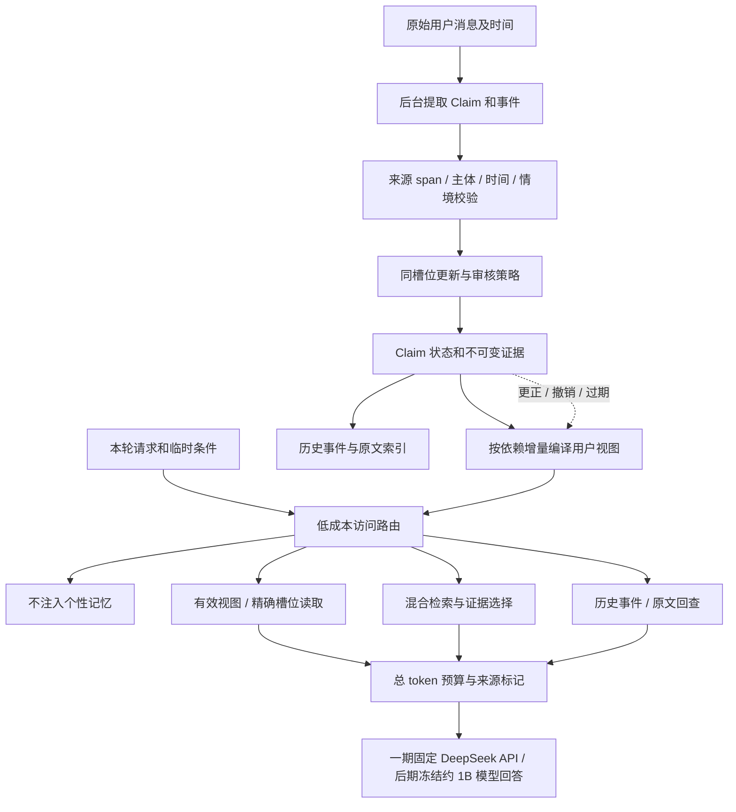

# Memoria-Agent：小模型长期陪伴记忆研究与实验计划书

版本：v1.2 · 制定、调研、偏好确认与本地接入核验日期：2026-10-10（Asia/Shanghai）

研究核查的代码基线：`591c7501d48879a4d4969e1af40984519c94b6a1`，制定计划时本地 HEAD 与远程 main 一致。v1.2 新增的本地 Embedding 接入、环境与回归结果属于**尚未提交的本地工作区**，不能描述为远程 main 已有能力。工作区原有 `.gitignore` 修改不属于本计划。除第 17 节明确列出的实际检查与运行外，本文的算法、正式实验结果和性能目标仍是拟议工作。

[文档导航](README.md) · [现行记忆模块](../memoria/memory/README.md) · [现行公开评测](../eval/README.md) · [提交规范](github提交规范.md)

## 1. 推荐方向与最终要回答的问题

下一阶段主线已确定为：**以长期陪伴产品为主，配套严格实验；先在本机 RTX 4060 8GB 上运行中文记忆检索，LLM 继续使用既有 DeepSeek API，再逐步切换到约 1B 的本地 LLM。** 记忆机制围绕带证据与适用条件的用户状态，以及能够及时失效的快速访问策略展开。暂用项目内名称 **Memoria-Familiar**，名称不是新算法已经成立的证明。

已确认的第一阶段组合是 **本地 `BAAI/bge-small-zh-v1.5` Embedding + 既有 DeepSeek API**。这一阶段先验证产品的跨会话记忆、纠正、变化适应与访问体验，属于本地检索与远程 LLM 协同；后期约 1B 模型自身承担写入、决策和回答的实验，才用于检验小模型自管理。2B/4B 保留为可选能力参考，不再作为默认主部署目标。

核心研究问题是：

> 在持续陪伴中，用户会改变，情境会改变，历史问题也会改变。系统什么时候可以直接复用一份简短的用户视图，什么时候必须重新检索或回查原文？能否在相同小模型和预算下，减少记忆访问成本，同时控制旧状态误用、临时需求固化及不适当个性化？

你的目标可以实现为可观察的行为：它记得以前的共同经历，回答会自然考虑你的习惯，知道哪些偏好已经改变，遇到证据不足时承认不知道。采用**阶段内固定 LLM + 外部长期记忆**，一期固定既有 DeepSeek API 配置，后期固定约 1B 本地模型。每轮把适用、可靠、少量的记忆送入上下文，而不是把每个用户的所有事实训练进模型权重。后者会增加纠正、删除和增量维护难度，可留作后期对照。

你提供的建议中的 Claim 更新、证据覆盖检索和治理底座都值得保留。产品推进优先交付**稳定的跨会话记忆、可纠正的当前状态和自然且有分寸的使用体验**；“用户视图能否安全、有效地复用”是访问机制的研究问题，结构化写入与证据覆盖是必要支撑。实验用于逐步核验每项产品改善，论文贡献待证据形成后再判断。第一阶段不承担完整多 Agent 服务化、多个数据库后端和在线强化学习。

### 1.1 将“像一个真正的人一样熟悉你”操作化

| 用户体验 | 可验证能力 | 示例 | 主要评价 |
| --- | --- | --- | --- |
| 记得久 | 隔很多会话还能找回证据 | “上次我们讨论论文时卡在哪？” | 跨会话 QA、证据召回 |
| 越来越懂我 | 相同任务在更多历史支持下更适合当前用户 | 推荐方案考虑时间、预算、表达偏好 | 个性化效用与随历史增长的曲线 |
| 不把我定死 | 区分习惯、临时例外与真实改变 | “今天想喝咖啡”不等于长期改喝咖啡 | 临时固化率、状态更新准确率 |
| 记得共同经历 | 保存发生过的事件及参与者、结果 | “我第一次答辩是哪次准备的？” | 事件归属、时间、多证据覆盖 |
| 熟悉但有分寸 | 在适当场景用记忆；不机械复述隐私或旧事 | 泛知识提问不强塞个人经历 | 过度应用率、适用性成对正确率 |
| 访问快 | 常见当前状态少查历史，复杂问题才深入 | 当前饮食偏好直接读视图；变化过程回查 | 访问 p50/p95、TTFT、完整成本 |
| 可以纠正 | 用户更正后很快改变后续回答 | “不是我搬家，是我朋友搬家” | 错误恢复轮数、失效传播 |

不先构造一个“亲密度 0–100”作为效果证据。真正的熟悉程度以任务表现、用户纠正次数和使用体验体现；这些实验也不证明模型具有人的主观感受。

## 2. 实际代码基础与瓶颈

### 2.1 应复用的能力

以下行号以固定基线为准，后续代码移动后以提交链接或函数定位。

| 代码位置 | 已有实现 | 本计划的使用方式 |
| --- | --- | --- |
| [`store.py:224`](../memoria/store.py#L224) `_memory_transaction` | 事务与嵌套 Savepoint | 原子应用 Claim 决策、版本变更与视图失效 |
| [`store.py:757`](../memoria/store.py#L757) `correct_memory` | 纠正生成新版本 | 保留原始事实与纠正链 |
| [`store.py:198`](../memoria/store.py#L198) 有效区间表 | 创建、替代、恢复及时间查询 | 保留系统内版本时间；独立新增事实发生时间 |
| [`engine.py:86`](../memoria/memory/engine.py#L86) `retrieve` | Keyword / Dense / 候选集 BM25 / RRF / 图扩展 | 固定当前基线；拆成候选召回与证据选择 |
| [`engine.py:197`](../memoria/memory/engine.py#L197) `remember` | 精确去重、相关候选、强化/替代 | 保留旧策略，新增可切换的主体—属性更新 |
| [`worker.py:26`](../memoria/memory/worker.py#L26) | 持久抽取任务、租约与审核候选 | 后台提取、校验、索引与增量编译 |
| [`agent.py:133`](../memoria/runtime/agent.py#L133) | 查询规划、召回、上下文装配与 trace | 接入访问路由、精确 token 与阶段计时 |
| [`episodic.py`](../memoria/memory/episodic.py) | 来源关联的任务/对话片段、固定与归档 | 继续保留；另加生活/共同事件表达 |
| [`governance.py`](../memoria/governance.py) | 独立共享空间 ACL、提案、审核和撤销 | 作为工程可靠性底座，暂不纳入主算法热路径 |

### 2.2 需要正视的缺口

1. **当前个人记忆没有稳定的 user / subject / predicate 键。** 不同值是否属于同一事实，仍先依赖整段文本/向量相似度；“我”和朋友、居住地和旅行地、计划和已发生事件容易混淆。已有共享 Agent 身份不等于个人 runtime 已完成多用户隔离。
2. **候选抽取后通常仍须审核。** `MemoryJobWorker` 调用 `stage_memory_reviews`，不会直接让候选进入长期召回。实验须说明自动批准、人工批准或等待的条件，不能默认每次对话已经自动学会。
3. **现有 `as_of` 主要描述系统版本生效时间。** 不能直接等同“现实中何时搬家”和“系统何时获知搬家”这两个时间。完整双时态语义仍需补齐。
4. **情景记录更接近任务片段。** 默认 90 天 TTL、1000 条活动容量，不能代表长期生活事件或共同经历已经被完整保留。
5. **预算为字符近似。** 小模型实验必须使用实际 tokenizer，并计算整个消息格式、历史、记忆、工具及生成预留。
6. **`top RRF score > 0` 被记录为 sufficient。** 这只表示存在召回结果，不能作为“证据足够回答”的校准概率。

### 2.3 一个已复现的更新边界

本次只读调用静态规则，未访问模型：旧文本“我住在北京”和新文本“我住在上海”的字符 Jaccard 为 **0.429**，`_contradicts` 为 False；[`engine.py:242`](../memoria/memory/engine.py#L242) 相关候选门槛为 **0.55**。无 Embedding 时，旧事实甚至不会进入 LLM 关系决策器。这不是证明所有地点更新都会失败，而是说明**整段相似度不能保证同槽位候选召回**。

对照检查：“我喜欢红茶→我不喜欢红茶”命中否定规则，“我喜欢红茶→我不喜欢绿茶”不命中；规则有保守边界，不能宣传为通用矛盾检测。

### 2.4 速度问题要先分解测量

| 路径 | 当前情况 | 优先改造 |
| --- | --- | --- |
| 回合准备 | 可能串行等待摘要、fast planner、检索 | 明确请求走确定性门控；仅歧义请求调规划模型 |
| 检索内向量回填 | `_backfill(items, limit=64)` 在 query embedding 之前 | 搬到后台；读路径只用已准备索引并设 deadline |
| 列表读取 | `_memory` 逐条查向量，存在 N+1 hydration | 批量读与向量惰性加载 |
| BM25 与分词 | 每次在候选中重算统计和排序 | 缓存版本化词元；必要时维护全库词频统计 |
| Episode | 活动记录取出后 Python 排序 | 来源/时间过滤与 episode FTS 索引 |
| Markdown | 多次写入触发有效记忆投影重写 | 异步合并刷新，明确投影版本 |

`sqlite-vec` 当前使用 KNN 接口，不等于已实现 HNSW/ANN，也不保证查询随规模呈对数增长。1K/10K/100K 规模实验必须明确实际后端。工程优化单列为 **Memoria-Optimized** 基线，主比较固定相同 planner 输出、相同 prepared index 与 index watermark。省略 planner 模型属于策略变化，独立消融；移出在线回填在冷态会改变可用向量，cold/live 下的质量—延迟与 deadline 降级另报，避免把这些收益全部归给研究方法。

### 2.5 当前评测的具体边界

现有 LongMemEval/LoCoMo 是原始历史直接建库，绕过生产抽取与审核；两者还把扫描窗口扩大到该题全部文档数，因此不能用五题召回率代表默认 2000 候选窗口的线上能力。LoCoMo 只对联合上下文生成答案，语义单层/情景单层的来源比较不能证明 QA 增益。

GateMem 每检查点重建一个前缀快照；reader 额外收到从编译状态得到的 `restricted_topics/deleted_topics`。这些不属于 Gold 标签，却揭示不可见主题的存在并辅助拒答；正式治理实验须去除或单独消融。其候选还先枚举授权记录再词面重排，并非正常问句检索路径。已有访问/删除成功不能忽略有权效用失败。

## 3. 截至 2026-10-10 的研究位置

### 3.1 已有工作与新颖性边界

| 一手来源 | 已有思路 | 对本计划的约束 |
| --- | --- | --- |
| [MemoryBank，2023 / AAAI 2024](https://arxiv.org/abs/2305.10250) | 长期交互、用户理解、强化与遗忘 | 陪伴和逐渐熟悉本身已有先例 |
| [Mem0，2025-04](https://arxiv.org/abs/2504.19413) | 抽取、整合和选择性召回 | “新增记忆增删改”不足以构成创新 |
| [A-MEM，2025-02](https://arxiv.org/abs/2502.12110) | 自组织笔记、链接和演化 | 图链接和持续巩固已有先例 |
| [Zep，2025-01](https://arxiv.org/abs/2501.13956)、[Graphiti](https://github.com/getzep/graphiti) | 时序关系与来源、历史失效 | Claim + 时间戳并非新的研究问题 |
| [Hindsight，2025-12](https://arxiv.org/abs/2512.12818) | 事实、经历、概括、信念分开；retain/recall/reflect | 证据和推断分离应作为设计底线 |
| [EverMemOS，2026-01](https://arxiv.org/abs/2601.02163) | MemCells、MemScenes、重构召回 | 分层压缩和画像已有完整系统 |
| [HiMem，2026-01](https://arxiv.org/abs/2601.06377) | Note 优先，LLM 判断是否回查 Episode；冲突重巩固 | 必须比较“每次模型判断足量”的访问策略 |
| [LightMem-A：Lightweight and Efficient Memory-Augmented Generation，2025-10](https://arxiv.org/abs/2510.18866) | 感知过滤、话题记忆、离线巩固 | “睡眠整理”不能单独作创新 |
| [LightMem-B：Lightweight LLM Agent Memory with Small Language Models，2026-04](https://arxiv.org/abs/2604.07798) | 小模型三层记忆、在线/离线分离、固定读取预算 | 小模型和低延迟已有直接相关方法；与上条同名但不同论文 |
| [PerMemBench，2026-05](https://arxiv.org/abs/2605.25535) | 用户相关的值得存储会话及预算化留存 | 个人化写入门控已有先例；可作为辅助测试 |
| [CAPTURE，2026-09-02，预印本](https://arxiv.org/abs/2609.02265) | 区分真实偏好变化、临时情境、歧义与污染；多时间尺度状态 | “首个区分临时例外与偏好变化”不成立 |
| [AMU，2026-09-29，预印本](https://arxiv.org/abs/2609.36976) | SLM 准入、去重和更新融合 | “用小模型管理写入”不是足够新颖的主贡献 |
| [StateAuditor，2026-08](https://arxiv.org/abs/2608.01619) | 从状态变化审查回答草稿，修复隐含旧依赖 | 数据库更新成功不等于回答行为已经更新 |
| [TRACE，2026-09-27，预印本](https://arxiv.org/abs/2609.33517) | 返回协作边界的依赖、失效、适用性、预算覆盖与 Return View | 有效视图已有直接先例，需增加对应对照 |
| [Invalidation Contracts，2026-08-31](https://arxiv.org/abs/2609.00243) | API 错误恢复建议缓存遇到服务端漂移时的失效契约 | 缓存版本约束已有相关设计，任务场景应明确区分 |

这里的日期为原始提交月份/日期，发表状态以来源页面为准；最新预印本并不等于结论已被独立复现。**当前调研不能证明本方案全球首创。** 论文贡献只能在最近相关方法复现、消融和失败分析之后形成。

### 3.2 值得投入的具体问题

我们拟验证的是组合中的一个可独立检验的机制：**把有来源、时间和情境条件的状态编译成小视图，给视图记录依赖，利用低成本、经过校准的路由决定是否复用。**

它和 HiMem 的区别候选是减少热路径的 LLM 足量判断；和 CAPTURE/AMU 的区别候选是读取视图复用及失效传播；和普通缓存的区别候选是检查状态、适用条件及证据依赖。TRACE 已覆盖依赖视图的重要部分，主要在返回协作边界构建视图；本计划拟测持续单用户交互中的增量复用和无需每轮 LLM 的校准路由是否提供效用—完整成本收益。[TRACE 原始设计](https://arxiv.org/html/2609.33517v1) 后期约 1B 的部署规模也不能单独作为贡献，CAPTURE 已采用 3B+LoRA。最终是否有算法贡献，取决于这些区别是否在严格预算下获得可重复收益。

有必要保留负面预期：HiMem 论文报告的 best-effort 在其配置下比 hybrid 少用 token 却更慢，说明“按需回退”不自动带来速度提升；必须计入路由和串行模型调用。[HiMem 全文](https://arxiv.org/html/2601.06377v1)

## 4. 研究假设与判定方式

| 编号 | 预注册假设 | 比较条件 | 失败意味着什么 |
| --- | --- | --- | --- |
| H1 | 主体—属性—情境定位减少漏更新和错误替代 | 同一个 extractor、同样原始证据与调用预算 | 问题可能主要在抽取，需先改抽取而非增加状态层 |
| H2（主） | 依赖与适用条件校验，使快速视图复用降低访问成本且维持个性化效用 | 与优化后的始终检索、普通缓存、TTL 缓存比较 | 仅工程缓存收益或风险不可控，收缩主贡献 |
| H3 | 无每轮 LLM 判断的校准路由比简单门控具有更好的效用—成本前沿 | 同记忆库、同 reader、同预算；加 HiMem 式足量 gate | 若启发式同样好，保留简单策略，不强行训练 |
| H4 | 历史增长能改善当前用户任务表现，同时不增加无关个性化 | 相同用户固定/等价 probe；历史前缀分别为 0/5/10/20/50 会话 | “越来越熟悉”在所测协议下不成立 |
| H5（后期） | 约 1B 本地模型自身写入与读取可实现主要收益 | 同一约 1B 模型承担 extractor/decider/reader；DeepSeek 教师写入单列，2B/4B 可选参考 | 若只能靠强模型整理，成果应称大小模型协同；一期 DeepSeek 结果不能证明 H5 |

主实验预先选择两个共同主指标：**当前状态/情境个性化效用**与**更正/情境变化后的旧状态误用率**；检索延迟、token 和后台成本为效率维度。通过质量门槛后才讨论提速。

开发目标而非已测结果：相对 Memoria-Optimized，个性化效用提升至少 5 个百分点，或效用在预设 2 个百分点非劣界内且访问 p95 降低至少 30%；同时减少临时固化和旧状态误用。正式实验用配对置信区间判定，不以单次点估计或调参后最好成绩替代。

## 5. 拟议系统与算法



### 5.1 四类内容，避免把所有话都升级成用户画像

| 内容 | 表达 | 更新语义 |
| --- | --- | --- |
| 稳定/当前状态 | 身份、居住地、长期偏好、目标 | 按属性排他性、来源与时间更新 |
| 条件/临时状态 | “工作日不喝咖啡”“今天想试咖啡” | 保留条件和有效期；不覆盖无条件长期偏好 |
| 生活与共同事件 | 搬家、答辩、旅行、共同完成某任务 | 保存参与者、发生时间、结果与原文证据 |
| 推断/计划/未决内容 | 从行为推测偏好、打算搬家、矛盾描述 | 明确状态，低置信时不作为确定事实使用 |

助手生成的“你应该喜欢……”不能自动成为用户偏好；重复召回、同一摘要反复回流也不能被当作多次独立用户支持。

### 5.2 Claim 最小模型

建议第一版字段如下，均为拟新增：

```text
claim_id, memory_id, user_id
subject_id, predicate, value_json, polarity
modality: stated | inferred | planned | uncertain
scope_json: 条件谓词；不明确时保留 unknown
fact_time_start, fact_time_end, time_precision
observed_at, recorded_at, retired_at
status: active | disputed | superseded | retracted
source_message_id, span_start, span_end, source_hash
support_group_ids, verification_status
slot_revision, extraction_model_revision
```

`stated` 表示用户陈述，不证明现实事实真实。`source_hash` 和 span 验证只证明来源可定位、引用匹配；语义支持度、是否真实发生、用户意图是否改变是不同判断。

事实有效时间与系统记录时间分别存储；区间采用半开语义。时间不确定时保存日期范围/粒度，不能擅自把“最近”“上周”补成精确瞬间。迟到信息产生新的不可变 Claim revision，关闭旧记录区间，保留旧版本的事实区间；不得原地改旧记录后再声称能恢复系统过去所知。查询同时过滤事实与记录区间，使 `fact_as_of` 与 `recorded_as_of` 能独立回答。先覆盖标准槽位，不承诺全部自由文本已具完整双时态推理。

先实现 12 类槽位/主题：居住地、学校/职业、表达语言、回答详细度、饮食偏好、工作习惯、娱乐偏好、学习目标、项目目标、时间约束、预算约束、明确重要事件。值和上下文可扩展；不能把所有开放事实硬塞入固定 schema。无法规范化的内容继续保留为事件/文本记忆并回查。

槽位需要元数据，例如 `cardinality=single|multi`、`default_scope`、`time_semantics`。喜欢 Python 和 Rust 可以并存；当前居住城市在同一情境、重叠时间下需要处理冲突。规则不适用时不得根据“最近的一条”直接删除旧值。

### 5.3 写入与变化判断

1. 只从当时可见的原始消息提取；对助手文本区分建议、对话承诺和已执行事件。
2. 校验引用文本、来源存在、说话者与主体；找同 user / subject / predicate 下各 scope 的候选，检查条件是否相交、包含或未知，而非只找完全相等 scope；不先用整段相似度淘汰同槽位事实。
3. 决策输出 `create / reinforce / supersede / contextualize / plan / dispute / defer`，包括目标 ID、引用 ID、理由与事实时间。
4. 确定性状态机检查目标存在、权限/身份、区间、排他性和版本条件；复杂语义由该阶段固定的 LLM 判断，一期使用既有 DeepSeek API，后期测试约 1B 模型，状态写入不由自由文本直接执行。
5. 在既有事务中更新 Claim、事实版本、证据操作、槽位 revision 和失效集合；后台重建索引/视图。

例子：

| 新消息 | 应处理为 | 不应发生 |
| --- | --- | --- |
| “我已经从北京搬到上海了” | 当前居住地更新，保留北京历史 | 因文本不像而只追加两条当前居住地 |
| “下个月可能搬上海” | planned / uncertain | 立即替代当前居住地 |
| “朋友从北京搬到上海了” | 朋友的状态 | 更新用户本人 |
| “我通常喝茶，但今天想试咖啡” | 本轮例外与短期经历 | 永久删除喝茶偏好 |
| “以后我都改喝咖啡，不喝茶了” | 显式偏好变化 | 因旧事实支持次数更多而拒绝改变 |
| “开会时回复简短，学习时讲详细” | 两个条件偏好并存 | 只留下最新详细度 |

**审核实验条件必须分开：**生产默认继续人工审核；离线完整写入实验由固定策略批准/延迟，不调用 Gold 决定批准。可选自动写入只对显式、来源通过、主体明确且无未决冲突的内容启用；推断/歧义继续待核实。人工确认的 Oracle 条件仅用于上限诊断，其人工开销另计。

本轮明确请求可作为即时临时条件使用，不必等待后台成为长期记忆。后续回合把尚未编译的近期用户消息作为有 watermark 的短期补充，避免“刚纠正但 worker 未完成”继续复用旧视图。

### 5.4 增量用户视图与有效性记录

视图是源 Claim 的派生投影，不能代替原文。第一版先用**确定性模板**表达槽位、条件、时间、来源 ID 和未决标记；再做小模型压缩消融，避免压缩质量掩盖访问机制。

视图例子：

```text
主题：饮食；user=u17；compiled_at=...
当前长期偏好：通常喝茶。[claim=c12, source=m88]
本轮条件：今晚想试咖啡。[source=m139, scope=本轮]
应用限制：本轮例外不更新长期偏好。
历史变化：需要时间线时回查；此视图不覆盖历史过程。
```

每个视图记录：

```text
view_id, user_id, topic_id, schema_revision, compiler_revision
dependency_claim_ids, dependency_slot_revisions
evidence_ids, covered_predicates
scope_conditions, fact_time_range, expires_at
compiled_watermark, unresolved_conflicts
token_count_by_tokenizer, source_support_status
```

关键是**不只记录已有 Claim ID，还记录槽位/主题 revision**。否则新增一条先前不在依赖列表中的纠正或矛盾，旧视图不会失效。`slot_revision` 第一版至少按 `(user, subject, predicate)` 聚合所有 scope 变化，包含新例外、空槽位与默认条件；视图登记用于推断的槽位，即使当时为空。主体或 scope 未知的新断言递增主题/用户 revision。初期每个 user 使用总 revision 是保守基线；再比较按主题/槽位增量失效减少不必要重建的效果。

复用分两种检查：**机器可核对硬约束**包括身份、撤销状态、revision、明确时间区间、编译器与 tokenizer 版本；**语义适用性估计**包括“开会/学习”等条件识别、需求覆盖与主体歧义。语义条件为 unknown 时不能伪装成硬约束已通过，应回查/澄清。来源删除、手工更正、批准、拒绝、版本恢复都应触发依赖重审；embedding 模型切换影响其相关缓存键。

watermark 使用单调 `source_seq` 的连续完成前缀，区分 `raw_watermark / extracted_contiguous_watermark / applied_revision / index_watermark / compiled_watermark`；最高某条任务完成序号不代表前面的重试/审核都已完成。尚未解析消息按用户级潜在变更阻断旧视图，只有同步规则可靠判定无关才放行。不能在读取前默认未处理消息不相关。

这些记录是**版本与适用范围的工程约束**，不构成事实真值或语义蕴含的形式化证明。“覆盖某槽位”也不等于已经覆盖问题所需全部证据。

并发语义：初始一致快照记录 `snapshot_revision`，首个回答 token 输出前检查 `output_barrier_revision`。相关依赖在 `(snapshot_revision, output_barrier_revision]` 变化时丢弃尚未输出的结果并有限次重跑，超过上限返回重试/澄清。屏障之后的变更作用于下一轮并记录事件顺序，不承诺已经流出的文字能被撤回。

### 5.5 低成本访问路由：四条路径

| 路径 | 条件候选 | 动作 | 预期额外模型调用 |
| --- | --- | --- | --- |
| R0 | 无个人化必要性 | 不注入长期个人记忆 | 0 |
| R1 | 当前简单状态，视图通过硬检查且预估充分 | 读取视图/精确槽位 | 0 |
| R2 | 缺槽位、主题新、适用性不确定 | 三路候选召回 + 证据选择 | query embedding；必要时 1 次重排 |
| R3 | 历史过程、关系、多跳、矛盾来源 | 事件/事实时间过滤 + 原文回查 | 严格限制分解/回查轮数 |

R0 不等于所有问候跳过所有已约定行为；如果当前请求本身依赖任务进展或用户约束，就必须识别。含个人词也不等于必须使用全部用户画像。

v0 使用可解释规则；v1 再用 logistic regression / 小型分类器预测 `risk(view is insufficient or inappropriate | q, state)`，输入为历史性提示、需求覆盖代理、冲突、源支持状态、条件匹配、主题距离、索引 watermark 等。正式候选的 60 个 train 用户再拆 40 fit + 20 calibration；20 dev 用户只选阈值，40 test 用户冻结，训练、校准、阈值和测试用户互斥。Gold 仅给离线训练/评分器，不进入测试路由。

选择快速路径的目标是：

```text
minimize  在线访问耗时 + token 费用 + 后台维护摊销
subject to  个性化效用不低于预设非劣界
            快速路径误用风险低于开发集设定阈值
            来源、身份、时间与版本硬约束通过
```

初始实验尝试误用风险目标 2%，同时报告覆盖率和用户簇 bootstrap 区间；若样本不足或分布漂移，退回检索。这里是**实证风险控制目标**，不声称对任意新用户有数学保证。防止“全部回退取得低风险”：同时报告快速路径比例、总效用、拒答/澄清比例和总成本。

```python
def choose_route(query, current_conditions, state_snapshot, budget):
    if not needs_personal_memory(query, current_conditions):
        return R0
    if asks_history_or_multi_event(query):
        return R3
    view = load_relevant_view(state_snapshot, query)
    if view and hard_checks(view, state_snapshot, current_conditions):
        risk = calibrated_risk(query, view, current_conditions)
        if risk <= threshold and fits(view, budget):
            return R1
    return R2
```

伪代码定义的是拟议边界；`needs_personal_memory` 与风险估计本身也会失败，必须独立评估，不能被当作 Oracle。

### 5.6 预算内证据选择

R2/R3 先合并现有检索候选，必要时最多分解为 2–3 项证据需求，再按增量覆盖、相关性、冗余和 token 成本选择：

```text
gain(m | S, q) = α relevance(m,q)
                 + β new_requirement_coverage(m,S,q)
                 - γ redundancy(m,S)
priority = gain / max(token_cost(m), 1)
```

coverage 是根据问题、候选 Claim 和来源推断的代理，不得读取测试答案或 Gold evidence。每次添加后重算增益，只有适用和未撤销候选可进入选择；相同总 tokenizer 预算下，与 RRF top-k、MMR 及 token 截断比较。正收益排序只是启发式，不写成未证明的全局最优算法。

初始记忆预算设 512/1024/2048 token，主配置 1024；常用视图尝试 256/512 token，计入同一个预算。总上下文另有 4096/8192 token 两档，生成预留与消息模板开销单算。历史问题必须能看到历史证据，不得仅用当前视图猜过去。

## 6. 与现有项目的最小改造映射

以下均为后续拟实现路径，不是本次已经创建的模块。

| 阶段 | 文件/模块 | 改造 | 验收 |
| --- | --- | --- | --- |
| P0 | `observability/tracing.py`、`runtime/agent.py`、`eval/` | 阶段耗时、usage、版本、错误分母、tokenizer 与公平协议 | 一题可追溯到配置、证据、回答、费用 |
| P1 | `engine.py`、`store.py`、`embedding.py`、`planner.py` | 去在线回填、批量 hydration、便宜门控、读 deadline | 相同输出/受控变化与冷暖延迟比较 |
| P2 | 新 `memory/claims.py`、`claim_extractor.py`、`claim_updater.py`、`store.py` | 槽位/证据/时间与决策状态机 | 漏更新、误替代、主体混淆独立评估 |
| P3 | 新 `memory/user_state.py`、`view_compiler.py`、`view_validity.py` | 小视图、依赖 revision、增量失效 | 新增矛盾也使旧视图失效；更正/撤销回归 |
| P4 | 新 `memory/access_router.py`、`retrieval/evidence_selector.py`、`prompting/` | R0–R3、覆盖选择、实际 token 装配 | 固定预算下效用—延迟与风险—覆盖曲线 |
| P5 | 新 `eval/run_streaming.py`、`adapters/`、`metrics/`、`experiments/` | 原始轨迹增量重放、统一基线、可恢复批次 | 用户隔离、无未来信息、完整错误记录 |

SQLite 第一版新增 `memory_claims`、`claim_evidence`、`user_slot_revisions`；视图稳定后再加 `user_views` 与依赖表。预留一次用户/主题 revision 查询，避免每轮遍历数百证据。复用既有事务与 memory_operations，实验数据库与用户生产数据库分开。迁移保留旧文本为 `unstructured`，不伪造主体、事实时间或证据 span。

生命周期检查覆盖：新建、强化、替代、恢复、删除来源、删除会话、人工纠正、worker 重试、视图编译中断、模型切换。当前删除会话仍可能保留已批准语义记忆；新层须明确标为 source unavailable 并执行对应策略，不能仅删除页面上可见的记录就宣称已经完全遗忘。

## 7. 数据集与分阶段评测范围

### 7.1 公开基准分工

| 数据集与来源 | 主要用途 | 第一轮 | 正式实验与限制 |
| --- | --- | --- | --- |
| [LongMemEval](https://arxiv.org/abs/2410.10813) / [官方仓库](https://github.com/xiaowu0162/LongMemEval) | 跨会话、时间、知识更新、拒答 | 现有 5 题回归；新增 50 题开发运行 | 冻结官方 500 问版本；开发题不计最终测试，或明确全量含开发仅作描述。原始 history RAG 与完整写入必须分报告 |
| [LoCoMo](https://aclanthology.org/2024.acl-long.747/) / [官方数据](https://github.com/snap-research/locomo) | 多会话事实、事件、人物归属 | 现有 5 题回归；按对话划开发集 | 原始公开 10 段对话的完整指定 QA 协议；按对话 bootstrap，不把大量题当独立用户 |
| [PersonaMem](https://arxiv.org/abs/2504.14225) | 动态画像和新场景个性化 | 冻结用户划分的 100–200 个 query | 保留官方候选选择协议，另做生成任务；选择率不能直接代替陪伴体验 |
| [PersonaMem-v2](https://arxiv.org/abs/2512.06688) / [数据卡](https://huggingface.co/datasets/bowen-upenn/PersonaMem-v2) | 隐式偏好、小模型个性化 | 独立用户开发子集 | 用户互斥留出；训练/测试 profile、偏好标签不入记忆 |
| [PairPref](https://arxiv.org/abs/2609.34526) | 偏好有效但不适宜应用 | 200 对开发/冻结子集 | 可获数据时用 1227 对官方协议；两情境均正确才算 pair success；不是完整长期写入基准 |
| [Memora](https://arxiv.org/abs/2604.20006) / [官方代码](https://github.com/geniesinc/Memora) | 记住、推理、推荐及过时信息 | 优先 week 轨迹适配 | 再扩大 month/quarter；保留官方标签与 FAMA，实现正确后才报告官方口径 |
| [PerMemBench](https://github.com/yeonjun-in/PerMemBench) | 长期重要信息在有限存储下的留存 | 后期辅助 | 与公开问答分开；主要检验存储策略，不代替回答效用 |
| [PersonaMem-v3](https://huggingface.co/datasets/bowen-upenn/PersonaMem-v3) | 陪伴、短期意图过期、过度个人化等泛化 | 后期冻结少量用户 | 新发布数据卡与许可先记录；只用 query 时间前可见事件，画像/推断/支持历史标签仅 scorer 使用 |
| [LongMemEval-V2](https://github.com/xiaowu0162/LongMemEval-V2) | Agent 轨迹与 accuracy–latency 泛化 | 可选附录 | 不作为陪伴主基准；其固定 reader/延迟协议另报，不与原 LongMemEval 混名 |
| [GateMem](https://github.com/rzhub/GateMem) | 权限/遗忘工程回归 | 维持现有检查点 | 非主陪伴算法成绩；当前代码是检查点快照适配，不是完整增量状态轨迹 |

所有数据先冻结 revision、SHA256、许可、原始 ID、分层抽样规则与样本数。一期正式验证优先中文自建增量轨迹与产品案例；后期公开泛化验证优先 **LongMemEval + PersonaMem/v2 + PairPref**，Memora、LoCoMo及新基准按工期渐进加入，不能第一周把所有集合铺满。

一期产品与检索效果优先在中文 CompanionStream 和中文人工核验案例上验证，固定本地 `BAAI/bge-small-zh-v1.5`。该模型的官方定位为中文 Embedding，不能由中文结果直接推断英文 LongMemEval/LoCoMo/PersonaMem 的检索质量。英文原协议实验需要另行固定适合英文或多语言的 Embedding，并在该组方法间保持一致；单列语言、模型、索引命名空间与成本。若将公开集翻译为中文，仅报告为经核验的派生诊断集，不与官方英文分数混比。[BGE 官方模型卡](https://huggingface.co/BAAI/bge-small-zh-v1.5)

PersonaMem-v1 先按每题 `end_index_in_shared_context` 截取可见历史，再建索引；不能先索引完整共享上下文、只在 prompt 阶段截断。各数据 adapter 明确自己的时间/前缀规则并有隔离检查。

新数据若尚未开放、许可不兼容或协议不完整，记录状态并先用已可复现基准推进，不自行猜造“官方成绩”。PersonaMem-v3 数据卡有研究用途/非商业许可边界；产品发布不能自动沿用研究数据许可。

接入 Memora 后保留官方 `FAMA_q = max(0, MPA_q − λ_q(1 − FAA_q))`，其中 `λ_q = N_forget / (N_presence + N_forget)`；各项定义按官方 scorer，不用自定义“过时率”直接代入后仍称官方分数。[Memora 原始公式与协议](https://arxiv.org/html/2604.20006v1)

### 7.2 自建 CompanionStream 轨迹集（工作名）

目的不是刷分，而是提供公开 QA 缺少的**更正—视图失效—回答恢复**与**临时例外—长期偏好**连续事件。

试点：20 个虚构用户 × 30 会话 × 4 checkpoint × 每 checkpoint 3 个 probe = **240 个 query**。正式候选：120 用户，按用户拆 60 train / 20 dev / 40 test；每人 50 会话，在第 5/10/20/35/50 会话各问 4 题，共 **2400 个 query，其中测试 800 个**。这是实验设计规模，不是已存在的数据。

正式集每个 checkpoint 的四类 probe 分别为当前状态、条件适用性、共同事件/历史推理、无关或证据不足；试点每 checkpoint 三题在四类中按预设规则轮换，保持 240 题规模。变化案例至少覆盖：明确改变、情境例外、缓慢变化、计划未发生、第三人归属、迟到信息、来源更正、撤销、久未使用、错误前提。

构建协议：

1. 先写有时间与主体的事实/事件状态机，Gold 放在 scorer 文件，系统只能看到对话。
2. 独立生成器把状态机实现为自然对话，加入不相关生活内容和释义，控制不能把答案直接放在 query 上一轮。
3. 保留“本人明确说了”和“生成器设定但历史未表达”的区别；后者对系统必须是不可知，不可算应答事实。
4. 测试用户、地点/项目组合、表达模板与时间模式留出；逐用户去重近似文本。中文与英文各有一组，语言结果分报，不把公开集自动翻译成绩冒充原协议。
5. 两名人工独立核查试点全部轨迹及正式测试至少 20%，重点审核更新/情境分歧；记录一致性、仲裁和不可判样本。人手不足则缩小正式规模，不取消核验。
6. 生成模型与主要 reader/judge 尽量跨家族；独立人工抽查模型风格偏好。拟参与的真实用户数据另征得使用同意，去标识化并单独报告。
7. Probe 是外部评测观察，不加入后续历史，也不把 Gold 纠正反馈给系统。真实反馈实验另设条件。

没有人工核验的合成轨迹只能称内部诊断集；公开基准和真实用户体验共同提供外部证据。

### 7.3 “越来越熟悉”的严格测法

每个用户保留一套不向系统泄露的 probe 家族，比较 0/5/10/20/50 会话前缀。分两条曲线：

- **知识累积曲线：**仅比较在各前缀都可知或逐步获得证据的固定/等价任务，标出可知性；避免后期题天然更简单。
- **变化适应曲线：**每个前缀按当时真实状态计分，观察变更后的误用、恢复与临时例外处理。

报告相对无记忆与固定早期画像的增益，不能强求每个 checkpoint 单调上升；新证据引入矛盾或用户发生变化时合理下降也应解释。

## 8. 两套评测路径，定位故障来源

**A：读取受控评测。** 使用同一份固定 Claim/文本库比较视图、路由、选择器。自动或人工构造的正确状态属于 Oracle store 上限，不能冒充生产端到端成绩。用途是隔离 H2/H3。

**B：完整增量评测。** 历史消息按当时顺序到达 → 该阶段固定 LLM 提取 → 来源检查 → 固定写入/审核策略 → 状态与视图更新 → 读取 → 同阶段固定 LLM 回答。统计累计写入成本、错误更新、worker lag 和回答效果。一期用既有 DeepSeek API 检验 H1/H4 和产品流程；后期约 1B 全程自管理条件再检验 H5。

后期必须分开报告三种条件：约 1B 自写入 + 自回答；DeepSeek 教师写入 + 约 1B 回答；一期 DeepSeek 写入 + DeepSeek 回答。教师提前整理的记忆需要计入生成成本和模型来源，不能混入约 1B 自管理成绩。模型切换时重放相同可见历史，保留旧阶段报告，不把 reader 或 extractor 变化归因于记忆算法。

两者都要跑，但主系统效果以 B 为准；A 显著提高而 B 不提高，说明写入误差吞掉了收益。

对后台一致性提供两个公开条件：checkpoint 等待固定审核/应用策略完成的 settled 模式；模拟真实到达速度、不等待 worker 的 live 模式。仅 `memory_jobs=completed` 不代表审核已应用。live 不得偷偷同步清空队列再测延迟；每个结果记录各 watermark、未处理消息和从更正到生效的时间。

## 9. 公平基线与消融

### 9.1 基线分层

| ID | 方法 | 目的 |
| --- | --- | --- |
| B0 | 仅最近窗口，无长期记忆 | 无记忆下限 |
| B1 | 小模型可容纳的全历史/滑动历史 | 长上下文参照；超窗口需标明截断策略 |
| B2 | 原始 history BM25 / Dense / 当前 RRF | 检索技术下限与原项目能力 |
| B3 | Memoria 当前写入 + RRF（固定代码基线） | 当前端到端基线 |
| B4 | Memoria-Optimized，固定 planner 输出及相同 prepared index | 把工程提速与算法增益分开；门控/cold lag 单列 |
| B5 | 同状态库始终检索 / 始终视图 | 路由必要性 |
| B6 | 普通缓存 / 固定 TTL 缓存 / 全 user revision 失效缓存 | 版本/细粒度依赖机制的增益 |
| B7 | HiMem 式 Note→LLM 足量判断→Episode | 与显式推理路由比较 |
| B8a / B8b | AMU-style 小模型写入 / CAPTURE-style 条件状态，各自独立 | 最近相关状态/写入控制 |
| B9 | 官方 Mem0 与 LightMem-A 或 LightMem-B | 外部系统与直接轻量先例参照 |
| B10 | TRACE-style 有效视图/coverage，明确单用户改写范围 | 检查增量复用和路由是否超出已有视图机制 |
| O1 | Gold 状态或 Gold evidence → 同 reader | 写入/召回上限诊断，单列 |

先完成 B0–B7，再按可复现性接入 B8/B9。作者代码必须锁版本；若仅复现某个思想，名称写 `HiMem-style` 等，列出差异，不能称官方复现。无法把外部系统的写入模型统一时，另列原作者配置，不能混进同模型公平表。

统一项：reader checkpoint、量化、上下文/记忆/输出 token、温度、历史输入、可用证据、外部工具、embedding、候选数与超时。相同 top-k 与相同 token budget 两组比较分开。Gold 类别、答案、支持历史与未来事件只能 scorer 读。

### 9.2 核心消融

| 消融 | 其余固定 | 检验 |
| --- | --- | --- |
| 无 subject/predicate 键 | 相同 extractor/decider | 漏更新是否来自候选预筛 |
| 无 scope / 临时条件 | 相同事实与视图 | 临时需求是否固化，偏好是否过度应用 |
| 无证据校验 | 相同提取输出 | 无支持内容是否污染状态 |
| 无视图版本失效 / 只有 TTL | 相同路由与上下文 | 更正后旧视图是否继续影响回答 |
| 总 user revision vs 主题/槽位 revision | 相同事实变化 | 局部编译是否减少维护且控制遗漏失效 |
| 固定规则 vs 校准分类器 vs LLM gate | 相同状态/视图 | 低成本策略是否值得训练 |
| RRF 截断 vs MMR vs coverage selector | 相同候选和 tokenizer 预算 | 收益是否来自多证据覆盖 |
| 确定性视图 vs 小模型压缩视图 | 相同源与预算 | 压缩是否引入新事实/遗漏关键条件 |
| 约 1B 自管理 vs DeepSeek 教师写入 + 约 1B reader | 相同消息、Embedding 和读策略；2B/4B 另作参考 | 强 extractor 的贡献与隐藏成本 |
| 无事件层 | 相同状态层 | 共同经历和历史问答是否确有增益 |

不一开始跑所有模块的全排列。先逐模块定位，再对 scope×失效、状态×路由做 2×2 交互实验，避免资源指数增长。

## 10. 指标定义与统计协议

### 10.1 写入与状态

| 指标 | 定义/口径 |
| --- | --- |
| Candidate Recall@K / Precision@K | 同一主体槽位关联事实被找到的比例/候选相关比例；候选 Gold 仅 scorer 可见 |
| Decision Macro-F1 | create/reinforce/supersede/contextualize/plan/dispute/defer 按类平均；低频类单列 |
| Current-State Accuracy | checkpoint 适用当前状态正确数 / 应可知状态数 |
| False Supersession Rate | 错误撤掉仍有效旧事实数 / 替代决策数；另报每 100 条输入误替代数 |
| Transient Crystallization Rate | 临时需求错误进入长期当前画像的案例数 / 临时需求案例数 |
| Unsupported Claim Rate | 无原文语义支持的新断言数 / 新断言数；span 匹配不能代替语义支持 |
| Event Attribution / Time Accuracy | 事件主体、参与者、时间区间正确；时间无法确定不处罚为“缺精确时间” |

### 10.2 读取、熟悉与行为

设第 i 个问题的必需证据集合为 E_i，最终进入 prompt 且内容仍可见的证据为 S_i：

```text
EvidenceRecall@B = mean_i |E_i ∩ S_i| / |E_i|
AllEvidenceHit@B = mean_i 1[E_i ⊆ S_i]
StaleUseRate = 使用已不适用旧状态的回答数 / 发生相关变化的测试回答数
ContextualPairSuccess = 两个情境均处理正确的偏好对数 / 偏好对总数
ViewEvidenceRisk = 快速路径中视图证据不足或不适用的次数 / 快速路径次数
FastAnswerRisk = 快速路径中最终回答错误或行为不适当的次数 / 快速路径次数
FastCoverage = 需要个人记忆且走快速路径的次数 / 需要个人记忆的请求数
```

E_i 为空的拒答题不放进 Recall 分母，拒答准确率、错误前提抵抗与过度拒绝分报。ID 在 prompt 出现而相关正文被裁掉，不算证据完整可见。

路由的离线监督目标采用 `ViewEvidenceRisk`，最终部署风险另用 `FastAnswerRisk`；即使正确视图下 reader 仍可能不遵从，不能把全部回答错归于视图不足。2% 指开发阶段视图风险目标，正式结果同时报告两类风险、CI、样本数与 FastCoverage，不能在样本不足时写成风险已保证。

另报最终 QA accuracy、个性化候选选择率、自由生成 rubric、重复推荐率、不必要提及个人信息率。记住个人信息与知道何时使用是两个指标；只减少个性化提及但效用下降也不能判成功。

恢复指标分两类：确定性版本失效用毫秒/事件数；语义回答恢复用更正后的第 1/2/3/5 个 probe 成功率及恢复轮数。未恢复或窗口结束的样本按 censored 保留，不能从平均中删除。

### 10.3 速度与完整成本

分段记录：`planner_ms`、`view_check_ms`、`slot_ms`、`query_embedding_ms`、`fts_ms`、`vector_ms`、`rerank_ms`、`evidence_select_ms`、`prompt_ms`、`TTFT_ms`、`generation_ms`、`turn_total_ms`。

额外记录写入提取/更新、视图编译、索引构建、重建、审核、worker 排队、CPU/GPU 内存、磁盘、缓存命中率及错误。模型有 usage 时存实际 input/output/reasoning token；缺 usage 时写 tokenizer 估计和缺失标志，不能填 0。

```text
生命周期总成本 = 首次建库 + 所有写入/更新 + 索引/视图维护 + 所有读取/回答
每次服务平均成本 = 生命周期总成本 / 已服务请求数
```

评测裁判费用单列，别与部署推理费用混合。离线暂停的后台任务仍计成本。模型压缩不得只报告读取 token 而隐藏写入和重建。

检索独立 microbenchmark 与端到端模型回答分开；冷启动、暖索引、视图 miss、刚更正、embedding 切换分别分报。每个负载至少 1000 个请求，重复 3 次，测 p50/p95/p99、超时/错误、并发 1/4/8；小于 100 个请求的分组不把 p95 当稳定 SLO。

1K/10K/100K 记忆规模由受控数据扩展，且应包含词汇相似干扰项与真实查询分布。纯随机字符串只适合压测，不证明语义检索质量。

### 10.4 统计、评分与失败分母

- 按用户/对话而非独立题做配对 cluster bootstrap，报告 95% CI；多个 probe 和时间点来自同一个人不能当独立样本。
- Pilot 用于估计差异方差和所需规模；正式实验前冻结主指标、非劣界、模型、prompt、参数和样本。LongMemEval 开发子集属于开发使用，不能再称无触碰的测试。
- 凡超时、解析失败、空回答、重试用尽均保留在分母，另报有效完成条件下的指标；不能只评分成功题。
- 事实题优先规范化规则或官方 scorer；开放生成盲评、随机方法顺序、跨家族 judge，人工核查至少 20% 或 100 题（取可承担的更大者），公布分歧。
- 多种子建议数据/顺序 seed=17/42/2026，只打乱用户或同时间可交换的独立事件，不打乱单用户因果会话。每方法/模型/seed 使用独立重置的数据库、视图及读取缓存，不跨 checkpoint 预热未来内容，预热成本计入。确定性解码依然记录随机性与重复运行；不把 3 seed 标准差当用户层 CI 的替代。R0 的无个人化路径使用率单报。
- 正式测试只使用冻结阈值；若测试发现错误，修复后的结果称新版本，并保留旧版与再次使用测试集的说明。

## 11. 实验矩阵与执行顺序

| 实验 | 主要比较 | 规模与预算 | 回答的问题 | 交付 |
| --- | --- | --- | --- | --- |
| E0 基线审计 | 原代码、离线/模型开关 | 5 题回归 + 20 个内部例子 | 当前真正测到了什么？ | 逐题报告、环境清单 |
| E1 更新机制 | 相似度 vs 槽位+证据+scope | 中文试点轨迹；一期同 DeepSeek extractor，后期同约 1B extractor 重测 | 错记来自抽取、候选还是更新？ | 决策混淆矩阵、时间线案例 |
| E2 视图有效性 | 无失效、TTL、user revision、slot revision | 原消息增量；同视图格式 | 什么时候旧视图还能用？ | stale risk、漏失效、重建成本 |
| E3 访问路由（主） | 始终查、始终视图、规则、分类器、LLM gate | 512/1024/2048 token；同状态库 | 减少访问成本是否牺牲效用？ | 风险—覆盖、效用—p95 图 |
| E4 条件个性化 | 无 scope vs 完整版 | PersonaMem、PairPref、临时例外 | 记忆是否被不恰当地应用？ | pair success、过度应用 |
| E5 长期成长 | 无记忆、早期固定画像、完整版 | 0/5/10/20/50 历史前缀 | 历史越多是否更了解当前用户？ | 了解曲线、变化恢复曲线 |
| E6 记忆覆盖 | RRF、MMR、coverage | 固定候选/总 token；LME/LoCoMo | 为什么检索到了仍答错？ | recall、all-evidence、QA |
| E7 本地小模型与成本 | 约 1B 自管理、DeepSeek 教师 + 约 1B；可选 2B/4B 参考 | 相同可见数据、Embedding 与预算；模型条件分别报告 | 小模型是否自身能够管理记忆？ | 质量—生命周期成本表 |
| E8 规模与故障 | 1K/10K/100K；并发与冷暖 | 检索压测、修正风暴/索引中断 | 快速访问能否持续可靠？ | p95/p99、错误、失效一致性 |
| E9 真实试用（可选） | 回合/日粒度交叉或用户分组 | 5–10 位同意用户、2–4 周 | 用户是否感到连贯且不过度打扰？ | 问卷、纠正率、个案；非总体结论 |

E1/E2 过关后再扩大 E3–E7；E8 的检索压测可较早开始。E9 的小样本定位产品可用性，不提供“像人一样”的统计证明。

## 12. 模型、算力与费用规划

### 12.1 当前本机与建议配置

本次实际检查：NVIDIA GeForce RTX 4060 Laptop GPU，显存 **8188 MiB**；物理 RAM **34,124,718,080 字节，约 31.8 GiB**。检查时显存已用约 2GB，该占用会变化，不等于实验可用容量固定为 6GB。

用户已明确选择**长期陪伴产品为主、严格实验配套、本机优先**。一期在当前 RTX 4060 8GB 上部署中文 BGE Embedding，继续使用既有 DeepSeek API 作为 LLM；先让记忆产品流程可用，再降低语言模型部署门槛到约 1B。每阶段用同配置基线和留出任务核验改善，保留算法失败分析，不以论文发表作为产品推进的前置条件。

| 用途 | 起点 | 说明 |
| --- | --- | --- |
| 一期 LLM | 既有 DeepSeek API | 本地接入保留 main 的 `deepseek-v4-flash` 和 fast 原有的 `qwen3.6-flash` 配置；本次未调用付费 LLM API。正式实验仍需逐组固定 reader/extractor/decider 的实际模型、槽位、端点与完整网络成本 |
| 一期中文 Embedding | [BAAI/bge-small-zh-v1.5](https://huggingface.co/BAAI/bge-small-zh-v1.5) | 已在项目独立 `.venv` 接入 `local://cuda`，模型位于项目根目录 `model/bge-small-zh-v1.5/`；固定 revision `8399f11f8da998fe932df2684586c92024219d05`、512 维 CLS、FP32、L2 和查询前缀。接线 smoke 已完成，正式检索质量、对等冷暖及共驻测试仍待实施 |
| 后期主要本地 LLM | 约 1B 参数模型，具体 checkpoint 待中文任务与服务兼容验证后确定 | 优先测试同一模型承担抽取、决策、回答；冻结参数量、量化和 tokenizer，按实际支持长度设上下文 |
| 后期强教师对照 | DeepSeek 写入/整理 + 约 1B 本地 reader | 教师的调用、token 和建库成本全部计入，单列结果；不能称约 1B 全程自管理 |
| 可选能力参考 | [Qwen3.5-2B](https://huggingface.co/Qwen/Qwen3.5-2B)、[Qwen3.5-4B](https://huggingface.co/Qwen/Qwen3.5-4B)、[Qwen3-4B-Instruct-2507](https://huggingface.co/Qwen/Qwen3-4B-Instruct-2507) | 非默认主部署目标；需要时测量能力与成本差距，更换模型须重跑对应基线 |
| Judge/Oracle extractor | 独立较强模型或人工 | 只用于评分/上限对照；外部 API 成本单列 |

本地 LLM 的全部活动参数、量化方式、是否思考、推理 token 上限、服务版本和调用参数都记录；DeepSeek API 记录供应商返回的模型标识、接口版本及调用参数，不臆测未公开的参数量。项目现有 LLM 适配器还不显式控制 temperature 等完整实验参数，P0 需补实验配置，不能假设服务默认值一致。

BGE 已通过实际权重、tokenizer/配置与编码策略指纹隔离向量命名空间，旧 `text-embedding-v3` 等历史向量不与新模型混算相似度；临时数据库的回填与读取已通过 smoke，正式实验仍须保留旧实验库并隔离重建索引。当前编码最多 512 tokenizer token，查询加 `为这个句子生成表示以用于检索相关文章：`，文档/记忆不加前缀。token-aware 分块和截断覆盖检查尚未完成，不能沿用 1600 字符就假设完整编码；前缀开关与检索阈值仍需中文开发集校准后冻结，不能用测试答案调参。CPU/GPU 少量暖查询已经测量，但对等冷性能、正式延迟/占用与后期约 1B LLM 共驻 8GB 显存的比较仍待实施。

一期本地 Embedding 适配器已经接入：独立 `.venv` 不继承 conda base 的 site-packages，使用 Python 3.13.5、PyTorch 2.9.0+cu126 和 Transformers 5.5.3。应用启动会预热本地模型，预热超时为 `max(120 秒, 常规 timeout_seconds)`，之后恢复常规请求超时；远程模型不预热。下载、接线与临时库检查的实际记录见第 17 节和[本地 Embedding 配置](本地Embedding配置.md)。现有 main/fast 配置保持，本次没有验证付费 LLM 对话。后期约 1B LLM 优先使用已支持 OpenAI-compatible API 的本地服务，WSL/Linux 后端作为可选方案；服务版本需在执行时核验。

### 12.2 控制实验爆炸

一期试点先固定既有 DeepSeek API 与本地中文 BGE，运行 4 个核心基线和 240 个中文 query：约 **960 次回答**，外加共享的消息摄入、必要 judge 和路由调用。先用 50-query 子集检查 API 成本、写入与检索行为，再决定是否扩大到 240 query。同配置共用可验证的提取产物用于 A 路径；B 路径写入策略不同的实验必须单独摄入。后期约 1B 的自管理与教师对照另建实验阶段，重放相同轨迹。

正式规模是后续候选而非一期承诺：800 query × 6 方法 × 1 个固定模型 × 3 seed = **14,400 次回答**；若再加第二个模型则共 **28,800 次回答**，还未计写入、教师、公开基准和 judge。一期 DeepSeek、后期约 1B 自管理及强教师条件分批决定，不能把切换模型作为每个实验都必须展开的组合。先确定关键 4–6 方法，再选择重复种子和可选 2B/4B 参考。

从最初 50 个 query 量出：每会话抽取 token、每条更新 token、每次编译 token、读取/回答 token、吞吐、重试和 judge 成本；按实际服务费率或租卡小时计算。没有测量前不承诺几百元以内或几天跑完。

允许的资源分档：

- **当前本机档：**中文 BGE + 既有 DeepSeek API，先 50-query 接线与成本试测，再 240-query 产品试点、状态/访问消融和 1K/10K 检索压测。
- **后期本地档：**约 1B LLM 的自管理、DeepSeek 教师对照与陪伴产品迁移；在 RTX 4060 8GB 上实际验证内存和吞吐，2B/4B 仅可选参考。
- **扩展验证档：**公开英文基准、100K 负载、更多模型或需要租卡的实验，核心产品与中文严格实验有收益后再决定，执行前明确费用与小时上限。

## 13. 12 周参考路线与停止条件

以个人/小团队持续投入为假设，周数表示工作顺序和工作量估计；正式计时从开始实施算，不把今日直接当作硬交付承诺。按产品主线滚动交付：P0 先让中文本地检索与现有 DeepSeek 对话可用，P2/P3 展示跨会话纠正与变化适应，后期再切换约 1B 本地 LLM；每次可用版本同时保留对应严格实验结果。

| 时间 | 里程碑 | 必做产物 | 进入下一步的门槛 |
| --- | --- | --- | --- |
| 第 1–2 周 / P0 | 本地中文 BGE + 既有 DeepSeek 接线、固定协议与基线 | 可用中文记忆对话、模型/索引 manifest、tokenizer、统一 runner、逐题日志；现有回归；50-query 成本试测 | 错误分母完整、无标签/未来泄漏、能复跑同配置 |
| 第 3 周 / P1 | 热路径工程优化 | 后台索引、门控、批量读取、分段 trace、冷暖基准 | 新旧语义行为受控；独立报告工程收益 |
| 第 4–5 周 / P2 | 条件 Claim 与状态更新 | 有限槽位、证据 span、事实/记录时间、状态机、试点集 | 主体/时间/条件用例正确；误替代受控；写入消融成立或明确失败 |
| 第 6–7 周 / P3 | 小视图与失效机制 | 确定性编译、slot revision、watermark、恢复/撤销测试 | 相关新增/更正使旧视图失效，失效故障回退可用 |
| 第 8–9 周 / P4 | 访问路由与覆盖选择 | 规则→校准分类器；同预算 B4/B5/B6/B7 消融 | 质量门槛通过，完整成本前沿优于至少一个强基线 |
| 第 10–11 周 / P5 | 约 1B 本地迁移与留出验证 | 中文产品回归、用户留出长期曲线、自管理/强教师分报；可选 2B/4B 与外部参照 | 冻结配置、用户簇 CI、负结果保留；一期 DeepSeek 证据与后期小模型证据分开 |
| 第 12 周 / P6 | 陪伴产品版本与实验报告 | 可用陪伴版本、可复现实验包、演示脚本和研究结论 | 所有数字能追溯到日志；能力边界说明完整 |

停止/调整规则：

1. P0 看见低分也继续记录，但若没有可复现输入和分母，不开始算法调参。
2. P2 若新状态机制比当前写入误替代更多，先修错误，不用下游更长上下文掩盖。
3. P4 若去掉学习路由完全不影响结果，保留规则路由，撤回“学习策略贡献”。
4. 若只有热缓存快而更正后明显误用，H2 不成立，优先状态正确性。
5. 若后台维护使平均总成本更高，报告在线延迟与生命周期成本的权衡，不声称整体更省。
6. 若收益只出现在合成集，公开个性化集无收益，定位为工程原型/失败边界研究，不包装成普遍算法突破。
7. 若约 1B 自管理失败而 DeepSeek 教师条件成功，产品可继续协同架构，实验明确写入依赖与成本；不能把一期 API 结果或教师产物包装成小模型独立记忆能力。2B/4B 作为可选排障参考，不自动替代约 1B 的主目标。

## 14. 首轮 P0 的具体任务清单

用户已确认一期技术组合，后续实施默认执行本节：先接入本地中文 BGE、复用既有 DeepSeek API，并固定评测协议，再逐步完善状态与访问机制。后期约 1B LLM 的选择、部署与自管理验证单独推进。

- [x] 基础环境：创建独立 `.venv`，安装项目、本地 Embedding 和 pytest 依赖；记录实际依赖环境，确认不继承 base site-packages。`sqlite-vec` 未安装，其后端验证仍待完成。
- [x] 基础接线：下载固定 revision 的 12 个 BGE 文件，接入 CPU/CUDA、512 维 CLS/FP32/L2/查询前缀与 namespace 指纹；临时库回填、检索、Embedding HTTP 路由和启动预热通过 smoke。
- [x] 接线定向回归：6 个文件实际得到 **65 passed、1 skipped**；前端 `npm ci --no-audit --no-fund` 与 `npm run build` 通过，仅项目内安装依赖。
- [ ] 按 tokenizer 完成 token-aware 分块、截断覆盖记录；用中文开发集校准前缀开关与相似度阈值，再冻结正式编码策略。
- [ ] 继续使用既有 DeepSeek API，逐组固定 reader/extractor/decider 实际模型与槽位；测网络时延和真实 usage，不把本地 Embedding 接入等同全部推理已本地化。
- [ ] 按 `feature/*` / `docs/*` 规则建立对应工作分支；保护已有 `.gitignore` 修改，单独处理本轮文件。
- [ ] 补齐事务、审核、情景和上下文等后续所需回归；现有 6 文件接线回归不代表完整测试套件通过。
- [ ] 将第 17 节已运行的 LongMemEval / LoCoMo 五题词面离线基线接入统一复现记录；BGE 中文接线结果与英文公共基准结果分别报告。
- [ ] 增加标准 manifest：commit、dirty diff 摘要、模型 revision、tokenizer、数据 SHA、prompt、seed、硬件、后端、预算、运行时间。
- [ ] 对 query planner、embedding、候选召回、视图检查、prompt 和 TTFT 加分段计时，不改变记忆算法。
- [ ] 给 reader/extractor/judge 独立实验配置；显式 temperature、生成上限、思考策略、timeout、重试与 usage。
- [ ] 设计统一系统输入与 scorer 输入分离结构；写标签隔离、时间前缀和最终正文 token 可见性检查。
- [ ] 构建 20 用户试点，先完成 4 种最容易出错的变化轨迹及人工核验，再扩大为 240 query。
- [ ] 用 50-query 试测费用/时间，冻结正式 P0 baseline 表和 P1–P2 的实际实施顺序。

现有可用命令（PowerShell，在仓库根目录；本机环境已准备，已有 `.venv` 不重复创建。新机器的 CUDA/本地依赖安装步骤见[本地 Embedding 配置](本地Embedding配置.md)，公开基准数据另行准备）：

```powershell
# 本次实际通过的 6 文件接线回归；sqlite-vec 未安装，相关 1 项跳过。
.\.venv\Scripts\python.exe -m pytest -q tests/test_local_embedding.py tests/test_embedding_client.py tests/test_memory_consistency.py tests/test_core.py tests/test_round9_setup_markdown.py tests/test_layer_settings_config.py

# 后续按变化补齐的回归，尚未在本轮全部执行。
.\.venv\Scripts\python.exe -m pytest -q tests/test_store_transactions.py tests/test_memory_review.py tests/test_episodic_memory.py tests/test_layered_context_budget.py

# 下载准备命令不含 LongMemEval 全量获取
.\.venv\Scripts\python.exe -m eval.prepare_public

# 独立配置目录避免 Settings.load 从生产 data 目录加载 models.override.toml
$taskEvalDir = Join-Path ([System.IO.Path]::GetTempPath()) ('memoria-research-' + [guid]::NewGuid().ToString())
New-Item -ItemType Directory -Path $taskEvalDir | Out-Null
$taskExamplePath = (Resolve-Path -LiteralPath '.\config.example.toml').Path.Replace('\', '/')
$taskEvalDatabase = (Join-Path $taskEvalDir 'experiment.db').Replace('\', '/')
$taskEvalConfig = Join-Path $taskEvalDir 'offline.toml'
$taskConfigText = @"
extends = "$taskExamplePath"
[storage]
database = "$taskEvalDatabase"
[memory.markdown]
enabled = false
"@
[System.IO.File]::WriteAllText($taskEvalConfig, $taskConfigText, [System.Text.UTF8Encoding]::new($false))

# 不加 --embedding/--qa/--judge，纯离线；runner 内另用实验临时数据库
.\.venv\Scripts\python.exe -m eval.run_longmemeval --config $taskEvalConfig
.\.venv\Scripts\python.exe -m eval.run_locomo --config $taskEvalConfig
```

以上命令中只有标明“本次实际通过”的回归已在当前 `.venv` 完成；五题词面离线基线另见第 17 节，不能理解为全部命令、付费模型或正式实验均已执行。现有 LoCoMo/GateMem runner **拒绝超过 5 条**，需要新增通用 runner/adapter 才能正式全量；不能只改文档说已经接全量。LongMemEval 全量数据获取、许可与 SHA 单独准备。

拟新增的实验配置示意（不是当前 CLI 可直接识别的参数）：

```yaml
experiment: familiar-product-pilot-v1.2
code_commit: 591c7501d48879a4d4969e1af40984519c94b6a1
dataset_manifest: companionstream-pilot-v1
split_unit: user
phase: local_chinese_embedding_with_existing_deepseek
reader: existing_deepseek_api_pinned_model
extractor: same_as_reader
embedding: BAAI/bge-small-zh-v1.5
embedding_execution: local
language: zh
memory_tokens: 1024
total_context_tokens: 8192
max_answer_tokens: 512
routes: [always_retrieve, view_only, ttl_cache, validity_router]
seeds: [17, 42, 2026]
gold_visibility: scorer_only
write_mode: settled_and_live_separate
```

## 15. 可复现产物与运行记录

每次 run 输出 `manifest.json`、`cases.jsonl`、`metrics.json`、成本明细、状态决策、检索 trace 和错误分析；原始数据/模型/日志遵守现有 Git 大文件规范，放 Git 忽略的实验目录。经过核验的精简汇总与图表才入库。

每题至少保留：

```text
run_id, question_id, user_id, checkpoint, event_time
visible_history_hash, ingestion_watermark, memory_revision
route, risk_estimate, view_id, hard_check_failures
candidate_ids, selected_ids, evidence_source_ids
memory_tokens, total_input_tokens, output_tokens
latency_segments, write_cost_amortized, retry_count
answer, score, scorer_version, human_review_status, error_type
```

回答不把隐含推理或用户原文公开到日志展示页面；日志用于研究时保留许可与去标识策略。错误类型至少包括抽取错、主体错、时序错、候选漏召、条件错、过期视图、路由不足、预算裁掉、reader 不遵从、过度拒绝、judge 争议和基础设施错误。

最终六张主要图：效用—访问 p95 前沿；快速路径风险—覆盖曲线；历史长度—个性化曲线；更正后恢复曲线；memory token—AllEvidenceHit/QA 曲线；规模—冷暖延迟/后台成本曲线。图中的目标线必须标 target，不能看起来像已测结果。

每轮提交按 `<type>: 中文描述 + 必要英文术语`，一个 commit 一个主要任务；例如 `test: 增加用户条件偏好与临时例外评测`、`feat: 增加用户视图依赖失效与版本校验`、`perf: 将记忆向量回填迁移至后台任务`。Git 作者/提交者使用已确认的 ZJ331456 配置。文档交付与远程推送为独立动作，本次不推送。

## 16. 一个有趣且能检查的陪伴演示

演示不靠夸张的“我太懂你了”，而是用 5 个连续阶段展示实际行为：

1. **认识：**你说在北京读研、喜欢茶、回答先给结论。下次讨论论文，它使用这几个当时有效条件。
2. **共同经历：**一起准备答辩，系统保存日期范围、讨论难点、你明确反馈有效的建议和来源。以后能回顾具体过程。
3. **例外：**你今晚想试咖啡，系统满足当次需求；第二天不会宣布你长期改喝咖啡。
4. **变化：**你毕业后去了上海，系统更新当前城市/阶段，保留北京读研的过去；“以前在哪”与“现在在哪”答案不同。
5. **纠正与分寸：**你更正“搬家的是朋友”，相关视图立即失效并恢复；你问泛知识时不无故重复毕业和搬家经历。

研究工作台显示：本次用了哪些来源、哪些当前状态、走哪条访问路径、花多少 token/毫秒、为什么旧视图不能用。普通聊天界面只给自然回答；技术 trace 留在检查面板，避免用户每轮都读系统实现。

## 17. 本次核查范围与当前交付状态

本次已阅读用户建议、固定 main 下的记忆/运行时/预算/治理/评测实现及项目文档，并核对上文一手研究来源。已有事实版本、审核及混合检索应继续复用；陪伴用户状态、依赖视图与校准路由是拟议工作。

v1.1 确定产品主线、本地中文 BGE + 既有 DeepSeek API 起步、后期约 1B 本地 LLM；v1.2 记录新增的本地环境与 Embedding 接入。新增代码、文档和报告仍属于未提交工作区，研究基线 main 的现状与本地新增能力分开描述。以下保留制定计划时的离线公共小样本基线，再列本地接线结果。

初次核查时 PATH Python 3.13.5 未发现 pytest / sqlite-vec；此后已建立独立 `.venv` 并安装 pytest，不能再把初次环境缺项当作当前状态。`sqlite-vec` 仍未安装，本轮也未执行完整测试套件。已有公开报告仅为五题试跑，不能证明系统已能长期陪伴或达到本计划的性能目标。

本次还实际运行了以下**不调用模型 API 的离线验证**，使用独立临时配置与数据库；读取、回答与评分效果明确分开：

| 运行 | 结果 | 可据此说明什么 |
| --- | --- | --- |
| LongMemEval 5 题词面检索 | 5/5 完成、错误 0；会话来源 recall 100%，标注轮次 recall 90%；QA=null | 五题读取接线可用，未测生成答案或真实写入 |
| LoCoMo 5 题词面检索 | 5/5 完成、错误 0；4 道可评分题语义/情景/联合/注入来源 recall 均 50%；来源 API 对应 100%；QA=null | 这组小样本仍有证据漏召，情景层未提高来源召回 |
| 分层机制离线 runner | 15/15 通过 | 固定机制夹具通过，不是公开算法成绩 |
| 手工输入隔离与分母断言 | 5/5 通过 | 所检查的标签隔离、前缀和错误分母行为成立，不能替代全部测试 |

原始报告保存在 Git 忽略目录：[LongMemEval 离线报告](../data/benchmark/results/20261010_eval_audit_longmemeval_lexical.json)、[LoCoMo 离线报告](../data/benchmark/results/20261010_eval_audit_locomo_lexical.json)。这些词面检索结果没有因 BGE 接入而重算，QA 仍为 null。

本地新增接线核验使用临时合成记忆库，**未调用 LLM API，未测试个人记忆库**：

| 实际完成项 | 结果与范围 |
| --- | --- |
| 独立 Python 环境 | `.venv`，Python 3.13.5、PyTorch 2.9.0+cu126、Transformers 5.5.3、SQLite 3.50.2；不继承 base site-packages，`pip check` 通过；向量后端配置为 `auto`；[环境报告](../data/reports/local_embedding_environment.json)记录实际依赖与不含密钥的模型槽位状态 |
| BGE 下载与接入 | 项目根目录 `model/bge-small-zh-v1.5/`，固定 revision `8399f11f8da998fe932df2684586c92024219d05`；所选 12 个远端模型/配置文件合计 **96,406,042 字节**，SDK 本地元数据与下载 manifest 另计；512 维 CLS、FP32、L2，最多 512 tokenizer token；查询使用中文检索前缀 |
| CUDA smoke | RTX 4060 Laptop；首批 4 句含加载 **49.295 秒**；8 次暖查询 median **3.015 ms**；4 条索引回填、2 次真实读取与 Embedding HTTP 路由通过；[GPU 报告](../data/reports/local_bge_cuda_smoke.json) |
| CPU smoke | 首批 4 句含加载 **7.737 秒**；8 次暖查询 median **5.644 ms**；相同接线检查通过；[CPU 报告](../data/reports/local_bge_cpu_smoke.json) |
| 新鲜进程启动与预热 | API 启动含本地预热 **8.545 秒**，Embedding 模型测试通过；[启动报告](../data/reports/local_bge_startup_api_smoke.json)；预热 timeout 为 `max(120 秒, 常规 timeout_seconds)` |
| 定向回归 | `test_local_embedding.py`、`test_embedding_client.py`、`test_memory_consistency.py`、`test_core.py`、`test_round9_setup_markdown.py`、`test_layer_settings_config.py`：最后复跑 **65 passed、1 skipped，6.32 秒**；skip 为未安装 `sqlite-vec`，不能声称该向量后端已验证 |
| 前端本机环境与构建 | 项目内 `npm ci --no-audit --no-fund` 成功安装 162 个包，`npm run build` 的 TypeScript 与 Vite 构建通过；`package.json` / 锁文件未改；本地 Embedding 页面显示无需 API Key |
| LLM 配置与费用范围 | main 保留既有 `deepseek-v4-flash`，fast 保留原有 `qwen3.6-flash`；上述 smoke 报告均为 `llm_api_calls=0`，没有付费 LLM 连通性、对话质量或 usage 结果 |

CPU/CUDA 采用相同模型/策略命名空间 `embedding-local:fb2b88ca2ec04dc58274575b1e74358195015e24f8ecc3e98c1a8c5b32f9de65`；设备名不作为策略变化。GPU 首批测量包含 torch 首次 import 和模型加载，CPU 测量发生在 GPU 之后、文件缓存已经热；新鲜进程的 API 启动测量同样是在文件缓存已热时进行。**不能由 49.295 秒与 7.737 秒直接比较 CPU/GPU 冷性能，也不能把 8.545 秒当作冷文件系统启动保证。** GPU 报告的 PyTorch peak allocated **102.97 MiB** 仅统计 tensor 分配，不是整个进程/驱动/CUDA 上下文的显存占用。

4 条合成记忆、2 个查询与每设备 8 次暖查询只证明所检查接线工作，不能代表 p95、长期陪伴质量或检索质量提升。本次没有运行新记忆算法、模型 QA、全量公开基准、正式中文 50-query / 240-query 或负载 p95 实验。token-aware 分块、阈值校准、完整实验 manifest、LLM usage 及正式效果表仍待完成。

下一步在已完成的基础环境与接线之上补齐 P0 可复现协议、中文 50-query 成本/错误试测，再决定 240-query 产品试点和条件 Claim / 视图访问机制的实施顺序。计划保留修改记录，实验假设和失败结果也会一起保存。
